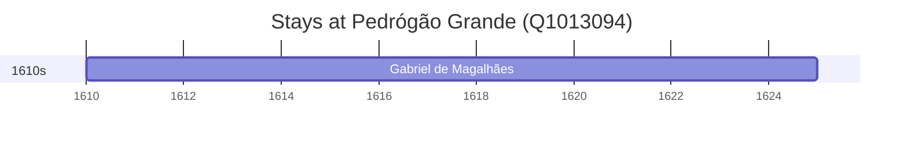

# Pedrógão Grande (Q1013094)

*municipality of Portugal*

Wikidata: [Q1013094](https://www.wikidata.org/wiki/Q1013094)

1 occurrence(s) across 1 transcribed value(s), 1 person(s).

**Transcribed variants:**

- `Pedrógão Grande, perto de Coimbra` (1×, 1610–1610)

| Date | Variant | Person | Type | Entity id | Real entity |
|------|---------|--------|------|-----------|-------------|
| 1610 | Pedrógão Grande, perto de Coimbra | Gabriel de Magalhães | nascimento | [deh-gabriel-de-magalhaes](deh-gabriel-de-magalhaes) | [rp695666](rp695666) |

