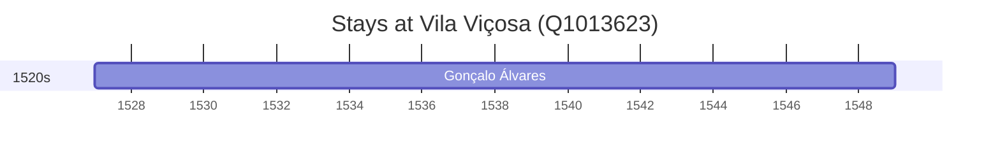

# Vila Viçosa (Q1013623)

*municipality of Portugal*

Wikidata: [Q1013623](https://www.wikidata.org/wiki/Q1013623)

1 occurrence(s) across 1 transcribed value(s), 1 person(s).

**Transcribed variants:**

- `Vila Viçosa, diocese de Évora` (1×, 1527–1527)

| Date | Variant | Person | Type | Entity id | Real entity |
|------|---------|--------|------|-----------|-------------|
| 1527 | Vila Viçosa, diocese de Évora | Gonçalo Álvares | nascimento | [deh-goncalo-alvares](deh-goncalo-alvares) | [rp127859](rp127859) |

