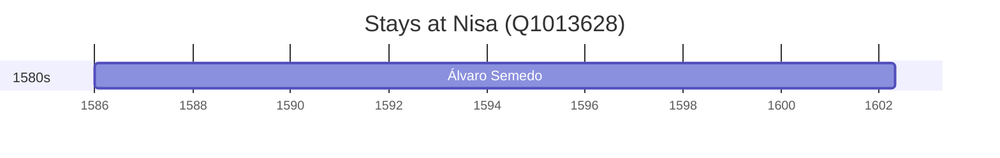

# Nisa (Q1013628)

*municipality of Portugal*

Wikidata: [Q1013628](https://www.wikidata.org/wiki/Q1013628)

1 occurrence(s) across 1 transcribed value(s), 1 person(s).

**Transcribed variants:**

- `Nisa, diocese de Portalegre` (1×, 1586–1586)

| Date | Variant | Person | Type | Entity id | Real entity |
|------|---------|--------|------|-----------|-------------|
| 1586 | Nisa, diocese de Portalegre | Álvaro Semedo | nascimento | [deh-alvaro-semedo](deh-alvaro-semedo) | — |

