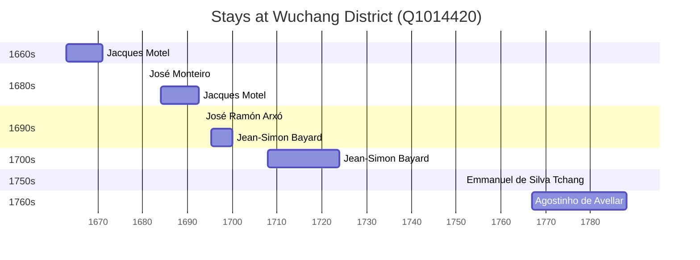

# Wuchang District (Q1014420)

*district of Wuhan in Hubei Province, China*

Wikidata: [Q1014420](https://www.wikidata.org/wiki/Q1014420)

11 occurrence(s) across 7 transcribed value(s), 7 person(s).

**Transcribed variants:**

- `Wuchang (Wou-tch'ang fou, Hou-kouang)` (1×, 1663–1663)
- `Wuchang` (3×, 1680–1767)
- `Wuchang, Houkouang` (1×, 1684–1684)
- `Wuchang (Wou-tch'ang fou)` (1×, 1692–1692)
- `Wuchang, Wou-tch'ang` (1×, 1693–1693)
- `Wuchang (Wou-tch'ang)` (3×, 1695–1713)
- `Wuchang (Wou-tch'ang fou), Hukwang` (1×, undated)

| Date | Variant | Person | Type | Entity id | Real entity |
|------|---------|--------|------|-----------|-------------|
| — | Wuchang (Wou-tch'ang fou), Hukwang | Manuel Marques | estadia | [deh-manuel-marques](deh-manuel-marques) | — |
| 1663 | Wuchang (Wou-tch'ang fou, Hou-kouang) | Jacques Motel | estadia | [deh-jacques-motel](deh-jacques-motel) | — |
| 1680-08-15 | Wuchang | José Monteiro | jesuita-votos-local | [deh-jose-monteiro](deh-jose-monteiro) | — |
| 1684 | Wuchang, Houkouang | Jacques Motel | estadia | [deh-jacques-motel](deh-jacques-motel) | — |
| 1692-08-02 | Wuchang (Wou-tch'ang fou) | Jacques Motel | morte | [deh-jacques-motel](deh-jacques-motel) | — |
| 1693-02-02 | Wuchang, Wou-tch'ang | José Ramón Arxó | jesuita-votos-local | [deh-jose-ramon-arxo](deh-jose-ramon-arxo) | — |
| 1695-05 | Wuchang (Wou-tch'ang) | Jean-Simon Bayard | estadia | [deh-jean-simon-bayard](deh-jean-simon-bayard) | — |
| 1708 | Wuchang (Wou-tch'ang) | Jean-Simon Bayard | estadia | [deh-jean-simon-bayard](deh-jean-simon-bayard) | — |
| 1713 | Wuchang (Wou-tch'ang) | Jean-Simon Bayard | estadia | [deh-jean-simon-bayard](deh-jean-simon-bayard) | — |
| 1751-04-11 | Wuchang | Emmanuel de Silva Tchang | jesuita-votos-local | [deh-emmanuel-de-silva-tchang](deh-emmanuel-de-silva-tchang) | [rp840713](rp840713) |
| 1767 | Wuchang | Agostinho de Avellar | estadia | [deh-agostinho-de-avellar](deh-agostinho-de-avellar) | — |

