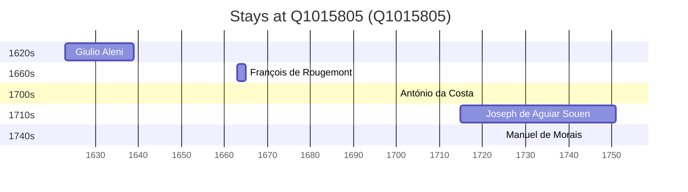

# Q1015805

*(fetch error: HTTP Error 429: Too Many Requests)*

Wikidata: [Q1015805](https://www.wikidata.org/wiki/Q1015805)

5 occurrence(s) across 5 transcribed value(s), 5 person(s).

**Transcribed variants:**

- `Changshu, Tch'ang-chou, Kiangsu` (1×, 1623–1623)
- `Chamxo (Tch'ang-chou)` (1×, 1663–1663)
- `Cham xo` (1×, 1700–1700)
- `Changshu, Kiang-sou, China` (1×, 1714–1714)
- `Cham xo (Igreja Leo Xam)` (1×, 1744–1744)

| Date | Variant | Person | Type | Entity id | Real entity |
|------|---------|--------|------|-----------|-------------|
| 1623 | Changshu, Tch'ang-chou, Kiangsu | Giulio Aleni | estadia | [deh-giulio-aleni](deh-giulio-aleni) | — |
| 1663 | Chamxo (Tch'ang-chou) | François de Rougemont | estadia | [deh-francois-de-rougemont](deh-francois-de-rougemont) | — |
| 1700 | Cham xo | António da Costa | estadia | [deh-antonio-da-costa-iii](deh-antonio-da-costa-iii) | — |
| 1714-11-25 | Changshu, Kiang-sou, China | Joseph de Aguiar Souen | nascimento | [deh-joseph-de-aguiar-souen](deh-joseph-de-aguiar-souen) | — |
| 1744-03-25 | Cham xo (Igreja Leo Xam) | Manuel de Morais | jesuita-votos-local | [deh-manuel-de-morais](deh-manuel-de-morais) | — |

### Co-presence

These persons were plausibly at this place during overlapping periods (interval estimation from stay dates; rough — see method note below).

| Period | Persons |
|--------|---------|
| 1740s | [Joseph de Aguiar Souen](deh-joseph-de-aguiar-souen), [Manuel de Morais](deh-manuel-de-morais) |

*1 overlapping pair(s) involving 2 person(s). Method: interval start = stay event date; end = next embarque/partida/different-place event, or death, or +15yr cap.*

