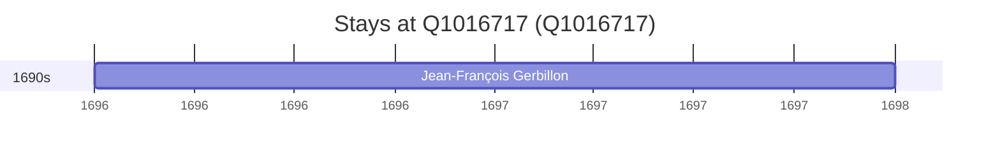

# Q1016717

*(fetch error: HTTP Error 429: Too Many Requests)*

Wikidata: [Q1016717](https://www.wikidata.org/wiki/Q1016717)

2 occurrence(s) across 1 transcribed value(s), 1 person(s).

**Transcribed variants:**

- `Selenginsk, Tartária` (2×, 1696–1698)

| Date | Variant | Person | Type | Entity id | Real entity |
|------|---------|--------|------|-----------|-------------|
| 1696 | Selenginsk, Tartária | Jean-François Gerbillon | estadia | [deh-jean-francois-gerbillon](deh-jean-francois-gerbillon) | — |
| 1698 | Selenginsk, Tartária | Jean-François Gerbillon | estadia | [deh-jean-francois-gerbillon](deh-jean-francois-gerbillon) | — |

