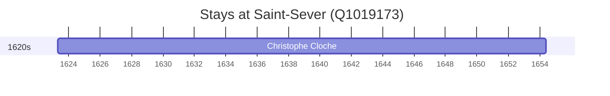

# Saint-Sever (Q1019173)

*commune in Landes, France*

Wikidata: [Q1019173](https://www.wikidata.org/wiki/Q1019173)

1 occurrence(s) across 1 transcribed value(s), 1 person(s).

**Transcribed variants:**

- `Saint-Sever-sur-l'Adour` (1×, 1623–1623)

| Date | Variant | Person | Type | Entity id | Real entity |
|------|---------|--------|------|-----------|-------------|
| 1623-04-19 | Saint-Sever-sur-l'Adour | Christophe Cloche | nascimento | [deh-christophe-cloche](deh-christophe-cloche) | — |

