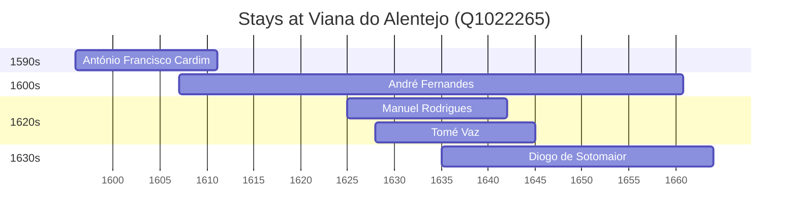

# Viana do Alentejo (Q1022265)

*municipality of Portugal*

Wikidata: [Q1022265](https://www.wikidata.org/wiki/Q1022265)

5 occurrence(s) across 1 transcribed value(s), 5 person(s).

**Transcribed variants:**

- `Viana do Alentejo, diocese de Évora` (5×, 1596–1635)

| Date | Variant | Person | Type | Entity id | Real entity |
|------|---------|--------|------|-----------|-------------|
| 1596 | Viana do Alentejo, diocese de Évora | António Francisco Cardim | nascimento | [deh-antonio-francisco-cardim](deh-antonio-francisco-cardim) | [rp536947](rp536947) |
| 1607 | Viana do Alentejo, diocese de Évora | André Fernandes | nascimento | [deh-andre-fernandes-ii-ref1](deh-andre-fernandes-ii-ref1) | — |
| 1625 | Viana do Alentejo, diocese de Évora | Manuel Rodrigues | nascimento | [deh-manuel-rodrigues-ii-ref2](deh-manuel-rodrigues-ii-ref2) | — |
| 1628 | Viana do Alentejo, diocese de Évora | Tomé Vaz | nascimento | [deh-tome-vaz](deh-tome-vaz) | — |
| 1635 | Viana do Alentejo, diocese de Évora | Diogo de Sotomaior | nascimento | [deh-diogo-de-sotomaior](deh-diogo-de-sotomaior) | — |

### Co-presence

These persons were plausibly at this place during overlapping periods (interval estimation from stay dates; rough — see method note below).

| Period | Persons |
|--------|---------|
| 1600s | [André Fernandes](deh-andre-fernandes-ii-ref1), [António Francisco Cardim](rp536947) |
| 1620s | [André Fernandes](deh-andre-fernandes-ii-ref1), [Manuel Rodrigues](deh-manuel-rodrigues-ii-ref2), [Tomé Vaz](deh-tome-vaz) |
| 1630s | [André Fernandes](deh-andre-fernandes-ii-ref1), [Diogo de Sotomaior](deh-diogo-de-sotomaior), [Manuel Rodrigues](deh-manuel-rodrigues-ii-ref2), [Tomé Vaz](deh-tome-vaz) |

*7 overlapping pair(s) involving 5 person(s). Method: interval start = stay event date; end = next embarque/partida/different-place event, or death, or +15yr cap.*

