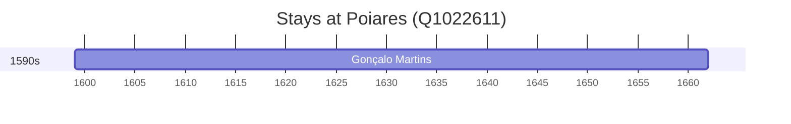

# Poiares (Q1022611)

*civil parish in Ponte de Lima, Portugal*

Wikidata: [Q1022611](https://www.wikidata.org/wiki/Q1022611)

1 occurrence(s) across 1 transcribed value(s), 1 person(s).

**Transcribed variants:**

- `Poiares (Santiago)` (1×, 1599–1599)

| Date | Variant | Person | Type | Entity id | Real entity |
|------|---------|--------|------|-----------|-------------|
| 1599 | Poiares (Santiago) | Gonçalo Martins | nascimento | [deh-goncalo-martins](deh-goncalo-martins) | — |

