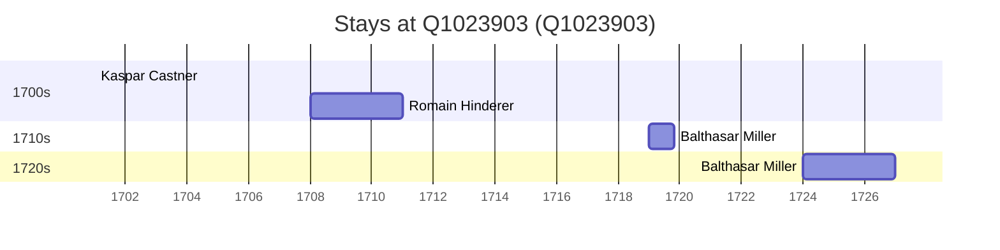

# Q1023903

*(fetch error: HTTP Error 429: Too Many Requests)*

Wikidata: [Q1023903](https://www.wikidata.org/wiki/Q1023903)

5 occurrence(s) across 4 transcribed value(s), 4 person(s).

**Transcribed variants:**

- `Sin-houi` (1×, 1701–1701)
- `Sinhouei, Kwangtung` (1×, 1708–1708)
- `Sin houei` (2×, 1719–1724)
- `Sin-houei` (1×, undated)

| Date | Variant | Person | Type | Entity id | Real entity |
|------|---------|--------|------|-----------|-------------|
| — | Sin-houei | João Pereira | estadia | [deh-joao-pereira-ii](deh-joao-pereira-ii) | — |
| 1701 | Sin-houi | Kaspar Castner | estadia | [deh-kaspar-castner](deh-kaspar-castner) | — |
| 1708 | Sinhouei, Kwangtung | Romain Hinderer | estadia | [deh-romain-hinderer](deh-romain-hinderer) | — |
| 1719 | Sin houei | Balthasar Miller | estadia | [deh-balthasar-miller](deh-balthasar-miller) | — |
| 1724 | Sin houei | Balthasar Miller | estadia | [deh-balthasar-miller](deh-balthasar-miller) | — |

