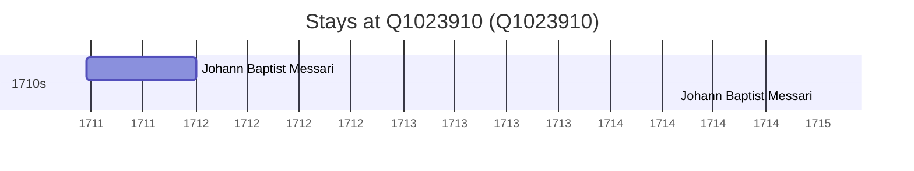

# Q1023910

*(fetch error: HTTP Error 429: Too Many Requests)*

Wikidata: [Q1023910](https://www.wikidata.org/wiki/Q1023910)

2 occurrence(s) across 1 transcribed value(s), 1 person(s).

**Transcribed variants:**

- `Lienchow` (2×, 1711–1715)

| Date | Variant | Person | Type | Entity id | Real entity |
|------|---------|--------|------|-----------|-------------|
| 1711-06-23 | Lienchow | Johann Baptist Messari | estadia | [deh-johann-baptist-messari](deh-johann-baptist-messari) | — |
| 1715 | Lienchow | Johann Baptist Messari | estadia | [deh-johann-baptist-messari](deh-johann-baptist-messari) | — |

