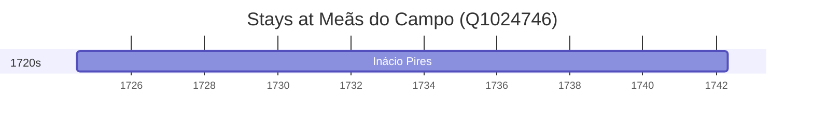

# Meãs do Campo (Q1024746)

*civil parish in Montemor-o-Velho*

Wikidata: [Q1024746](https://www.wikidata.org/wiki/Q1024746)

1 occurrence(s) across 1 transcribed value(s), 1 person(s).

**Transcribed variants:**

- `Meãs do Campo, diocese de Coimbra` (1×, 1724–1724)

| Date | Variant | Person | Type | Entity id | Real entity |
|------|---------|--------|------|-----------|-------------|
| 1724-07-04 | Meãs do Campo, diocese de Coimbra | Inácio Pires | nascimento | [deh-inacio-pires](deh-inacio-pires) | — |

