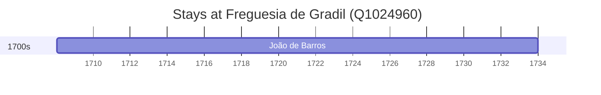

# Freguesia de Gradil (Q1024960)

*former civil parish in Portugal*

Wikidata: [Q1024960](https://www.wikidata.org/wiki/Q1024960)

1 occurrence(s) across 1 transcribed value(s), 1 person(s).

**Transcribed variants:**

- `Gradil, diocese de Lisboa` (1×, 1708–1708)

| Date | Variant | Person | Type | Entity id | Real entity |
|------|---------|--------|------|-----------|-------------|
| 1708-01-22 | Gradil, diocese de Lisboa | João de Barros | nascimento | [deh-joao-de-barros](deh-joao-de-barros) | — |

