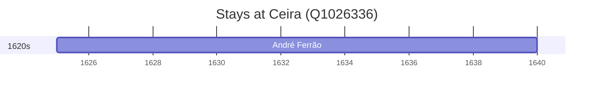

# Ceira (Q1026336)

*civil parish in Coimbra*

Wikidata: [Q1026336](https://www.wikidata.org/wiki/Q1026336)

1 occurrence(s) across 1 transcribed value(s), 1 person(s).

**Transcribed variants:**

- `Ceia, diocese de Coimbra` (1×, 1625–1625)

| Date | Variant | Person | Type | Entity id | Real entity |
|------|---------|--------|------|-----------|-------------|
| 1625 | Ceia, diocese de Coimbra | André Ferrão | nascimento | [deh-andre-ferrao](deh-andre-ferrao) | [rp773563](rp773563) |

