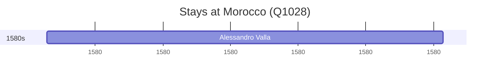

# Morocco (Q1028)

*sovereign state in North Africa*

Wikidata: [Q1028](https://www.wikidata.org/wiki/Q1028)

1 occurrence(s) across 1 transcribed value(s), 1 person(s).

**Transcribed variants:**

- `Marrocos` (1×, 1580–1580)

| Date | Variant | Person | Type | Entity id | Real entity |
|------|---------|--------|------|-----------|-------------|
| 1580 | Marrocos | Alessandro Valla | estadia | [deh-alessandro-valla](deh-alessandro-valla) | — |

