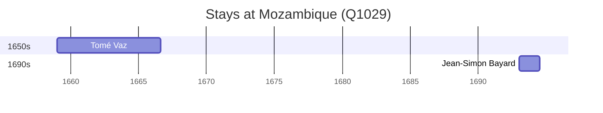

# Mozambique (Q1029)

*country in Southeastern Africa; the current form of Mozambique since 1975*

Wikidata: [Q1029](https://www.wikidata.org/wiki/Q1029)

7 occurrence(s) across 3 transcribed value(s), 6 person(s).

**Transcribed variants:**

- `Moçambique` (5×, 1659–1749)
- `[No mar, perto de Moçambique]` (1×, 1692–1692)
- `[Perto de Moçambique]` (1×, undated)

| Date | Variant | Person | Type | Entity id | Real entity |
|------|---------|--------|------|-----------|-------------|
| — | Moçambique | Gottfried Xaver von Laimbeckhoven | estadia | [deh-gottfried-xaver-von-laimbeckhoven](deh-gottfried-xaver-von-laimbeckhoven) | — |
| — | [Perto de Moçambique] | Pedro Martins | estadia | [deh-pedro-martins](deh-pedro-martins) | — |
| 1659 | Moçambique | Tomé Vaz | estadia | [deh-tome-vaz](deh-tome-vaz) | — |
| 1664 | Moçambique | Tomé Vaz | estadia | [deh-tome-vaz](deh-tome-vaz) | — |
| 1692-09-02 | [No mar, perto de Moçambique] | Michel Alfonso Chen | morte | [deh-michel-alfonso-chen](deh-michel-alfonso-chen) | — |
| 1693-01 | Moçambique | Jean-Simon Bayard | estadia | [deh-jean-simon-bayard](deh-jean-simon-bayard) | — |
| 1749-07-05 | Moçambique | Touissant Masson | morte | [deh-touissant-masson](deh-touissant-masson) | — |

