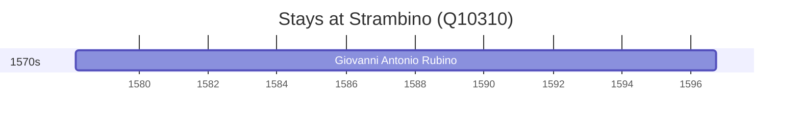

# Strambino (Q10310)

*Italian comune*

Wikidata: [Q10310](https://www.wikidata.org/wiki/Q10310)

1 occurrence(s) across 1 transcribed value(s), 1 person(s).

**Transcribed variants:**

- `Strambino, diocese de Ivrea, Piemonte` (1×, 1578–1578)

| Date | Variant | Person | Type | Entity id | Real entity |
|------|---------|--------|------|-----------|-------------|
| 1578-03-01 | Strambino, diocese de Ivrea, Piemonte | Giovanni Antonio Rubino | nascimento | [deh-giovanni-antonio-rubino](deh-giovanni-antonio-rubino) | — |

