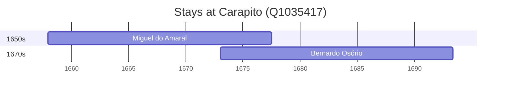

# Carapito (Q1035417)

*civil parish in Aguiar da Beira*

Wikidata: [Q1035417](https://www.wikidata.org/wiki/Q1035417)

2 occurrence(s) across 2 transcribed value(s), 2 person(s).

**Transcribed variants:**

- `Carapito ou Mangualde, diocese de Viseu` (1×, 1657–1657)
- `Carapito, diocese de Viseu` (1×, 1673–1673)

| Date | Variant | Person | Type | Entity id | Real entity |
|------|---------|--------|------|-----------|-------------|
| 1657-12-13 | Carapito ou Mangualde, diocese de Viseu | Miguel do Amaral | nascimento | [deh-miguel-do-amaral](deh-miguel-do-amaral) | [rp086368](rp086368) |
| 1673 | Carapito, diocese de Viseu | Bernardo Osório | nascimento | [deh-bernardo-osorio](deh-bernardo-osorio) | — |

### Co-presence

These persons were plausibly at this place during overlapping periods (interval estimation from stay dates; rough — see method note below).

| Period | Persons |
|--------|---------|
| 1670s | [Bernardo Osório](deh-bernardo-osorio), [Miguel do Amaral](rp086368) |

*1 overlapping pair(s) involving 2 person(s). Method: interval start = stay event date; end = next embarque/partida/different-place event, or death, or +15yr cap.*

