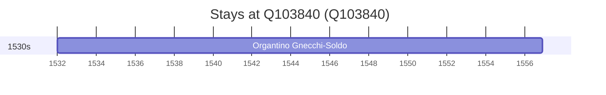

# Q103840

*(fetch error: HTTP Error 429: Too Many Requests)*

Wikidata: [Q103840](https://www.wikidata.org/wiki/Q103840)

1 occurrence(s) across 1 transcribed value(s), 1 person(s).

**Transcribed variants:**

- `Casto Val Sabbia, Brescia` (1×, 1532–1532)

| Date | Variant | Person | Type | Entity id | Real entity |
|------|---------|--------|------|-----------|-------------|
| 1532 | Casto Val Sabbia, Brescia | Organtino Gnecchi-Soldo | nascimento | [deh-organtino-gnecchi-soldo](deh-organtino-gnecchi-soldo) | — |

