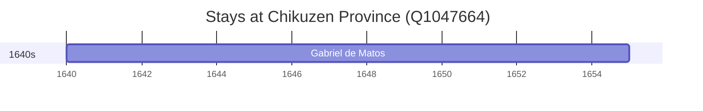

# Chikuzen Province (Q1047664)

*province of Japan*

Wikidata: [Q1047664](https://www.wikidata.org/wiki/Q1047664)

1 occurrence(s) across 1 transcribed value(s), 1 person(s).

**Transcribed variants:**

- `Chikuzen, Japão` (1×, 1640–1640)

| Date | Variant | Person | Type | Entity id | Real entity |
|------|---------|--------|------|-----------|-------------|
| 1640 | Chikuzen, Japão | Gabriel de Matos | estadia | [deh-gabriel-de-matos](deh-gabriel-de-matos) | — |

