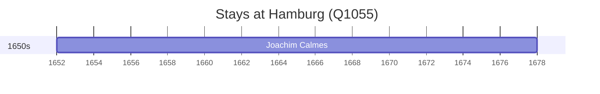

# Hamburg (Q1055)

*city and state in the North of Germany*

Wikidata: [Q1055](https://www.wikidata.org/wiki/Q1055)

2 occurrence(s) across 1 transcribed value(s), 2 person(s).

**Transcribed variants:**

- `Hamburgo` (2×, 1652–1652)

| Date | Variant | Person | Type | Entity id | Real entity |
|------|---------|--------|------|-----------|-------------|
| — | Hamburgo | Martino Martini | estadia | [deh-martino-martini](deh-martino-martini) | — |
| 1652 | Hamburgo | Joachim Calmes | nascimento | [deh-joachim-calmes](deh-joachim-calmes) | — |

