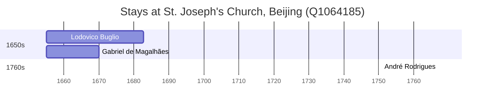

# St. Joseph's Church, Beijing (Q1064185)

*church building in Beijing, China*

Wikidata: [Q1064185](https://www.wikidata.org/wiki/Q1064185)

6 occurrence(s) across 1 transcribed value(s), 3 person(s).

**Transcribed variants:**

- `Tong-t'ang, Pequim` (6×, 1655–1767)

| Date | Variant | Person | Type | Entity id | Real entity |
|------|---------|--------|------|-----------|-------------|
| 1655 | Tong-t'ang, Pequim | Lodovico Buglio | estadia | [deh-lodovico-buglio](deh-lodovico-buglio) | — |
| 1655 | Tong-t'ang, Pequim | Gabriel de Magalhães | estadia | [deh-lodovico-buglio-ref1](deh-lodovico-buglio-ref1) | — |
| 1662 | Tong-t'ang, Pequim | Lodovico Buglio | estadia | [deh-lodovico-buglio](deh-lodovico-buglio) | — |
| 1664 | Tong-t'ang, Pequim | Lodovico Buglio | estadia | [deh-lodovico-buglio](deh-lodovico-buglio) | — |
| 1669 | Tong-t'ang, Pequim | Lodovico Buglio | estadia | [deh-lodovico-buglio](deh-lodovico-buglio) | — |
| 1767-02-02 | Tong-t'ang, Pequim | André Rodrigues | jesuita-votos-local | [deh-andre-rodrigues](deh-andre-rodrigues) | — |

