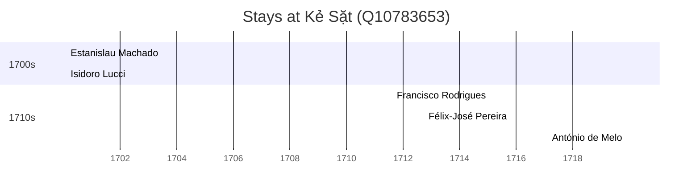

# Kẻ Sặt (Q10783653)

*thị trấn thuộc huyện Bình Giang*

Wikidata: [Q10783653](https://www.wikidata.org/wiki/Q10783653)

5 occurrence(s) across 2 transcribed value(s), 5 person(s).

**Transcribed variants:**

- `Kẻ Sặt, Tonquim` (4×, 1700–1719)
- `«in pago Ke Sat»` (1×, 1700–1700)

| Date | Variant | Person | Type | Entity id | Real entity |
|------|---------|--------|------|-----------|-------------|
| 1700-02-02 | «in pago Ke Sat» | Estanislau Machado | jesuita-votos-local | [deh-estanislau-machado](deh-estanislau-machado) | — |
| 1700-02-02 | Kẻ Sặt, Tonquim | Isidoro Lucci | jesuita-votos-local | [deh-isidoro-lucci](deh-isidoro-lucci) | — |
| 1711-08-15 | Kẻ Sặt, Tonquim | Francisco Rodrigues | jesuita-votos-local | [deh-francisco-rodrigues-ref3](deh-francisco-rodrigues-ref3) | — |
| 1712-09-29 | Kẻ Sặt, Tonquim | Félix-José Pereira | jesuita-votos-local | [deh-felix-jose-pereira](deh-felix-jose-pereira) | — |
| 1719-12-03 | Kẻ Sặt, Tonquim | António de Melo | jesuita-votos-local | [deh-antonio-de-melo](deh-antonio-de-melo) | — |

