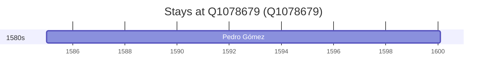

# Q1078679

*(fetch error: HTTP Error 429: Too Many Requests)*

Wikidata: [Q1078679](https://www.wikidata.org/wiki/Q1078679)

1 occurrence(s) across 1 transcribed value(s), 1 person(s).

**Transcribed variants:**

- `Funai` (1×, 1585–1585)

| Date | Variant | Person | Type | Entity id | Real entity |
|------|---------|--------|------|-----------|-------------|
| 1585 | Funai | Pedro Gómez | estadia | [deh-pedro-gomez](deh-pedro-gomez) | — |

