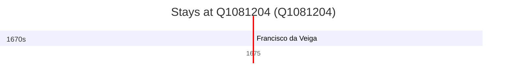

# Q1081204

*(fetch error: HTTP Error 429: Too Many Requests)*

Wikidata: [Q1081204](https://www.wikidata.org/wiki/Q1081204)

2 occurrence(s) across 2 transcribed value(s), 2 person(s).

**Transcribed variants:**

- `Kiungchow (K'iong-tcheou fou), Hainan` (1×, 1660–1660)
- `Kiungchow` (1×, 1675–1675)

| Date | Variant | Person | Type | Entity id | Real entity |
|------|---------|--------|------|-----------|-------------|
| 1660-10-09 | Kiungchow (K'iong-tcheou fou), Hainan | Jean Forget | morte | [deh-jean-forget](deh-jean-forget) | — |
| 1675-02-02 | Kiungchow | Francisco da Veiga | jesuita-votos-local | [deh-francisco-da-veiga](deh-francisco-da-veiga) | — |

