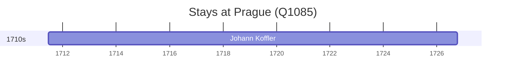

# Prague (Q1085)

*capital city of the Czech Republic*

Wikidata: [Q1085](https://www.wikidata.org/wiki/Q1085)

3 occurrence(s) across 2 transcribed value(s), 3 person(s).

**Transcribed variants:**

- `Praga` (2×, 1711–1711)
- `Praga, Boémia` (1×, undated)

| Date | Variant | Person | Type | Entity id | Real entity |
|------|---------|--------|------|-----------|-------------|
| — | Praga | François Noël | estadia | [deh-francois-noel](deh-francois-noel) | — |
| — | Praga, Boémia | Valentim Stansel | estadia | [deh-valentim-stansel](deh-valentim-stansel) | — |
| 1711-06-19 | Praga | Johann Koffler | nascimento | [deh-johann-koffler](deh-johann-koffler) | — |

