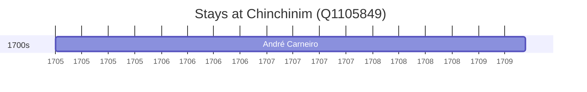

# Chinchinim (Q1105849)

*village in Goa, India*

Wikidata: [Q1105849](https://www.wikidata.org/wiki/Q1105849)

1 occurrence(s) across 1 transcribed value(s), 1 person(s).

**Transcribed variants:**

- `Chinchinim, Goa` (1×, 1705–1705)

| Date | Variant | Person | Type | Entity id | Real entity |
|------|---------|--------|------|-----------|-------------|
| 1705 | Chinchinim, Goa | André Carneiro | estadia | [deh-andre-carneiro](deh-andre-carneiro) | — |

