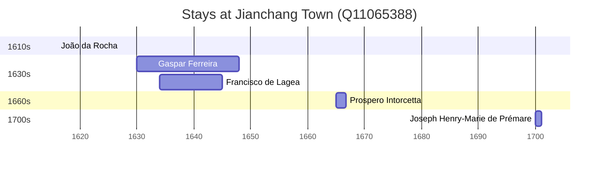

# Jianchang Town (Q11065388)

Wikidata: [Q11065388](https://www.wikidata.org/wiki/Q11065388)

5 occurrence(s) across 5 transcribed value(s), 5 person(s).

**Transcribed variants:**

- `Kien-tch'ang, Kiangsi` (1×, 1616–1616)
- `Kienchang no Kiangsi` (1×, 1630–1630)
- `Kienchang (Kien-tch'ang), Kiangsi` (1×, 1634–1634)
- `Kienchang (Kien-tchang), Kiangsi` (1×, 1665–1665)
- `Kienchang (Kien-tchang)` (1×, 1700–1700)

| Date | Variant | Person | Type | Entity id | Real entity |
|------|---------|--------|------|-----------|-------------|
| 1616 | Kien-tch'ang, Kiangsi | João da Rocha | estadia | [deh-joao-da-rocha](deh-joao-da-rocha) | — |
| 1630 | Kienchang no Kiangsi | Gaspar Ferreira | estadia | [deh-gaspar-ferreira](deh-gaspar-ferreira) | — |
| 1634 | Kienchang (Kien-tch'ang), Kiangsi | Francisco de Lagea | estadia | [deh-francisco-de-lagea](deh-francisco-de-lagea) | — |
| 1665 | Kienchang (Kien-tchang), Kiangsi | Prospero Intorcetta | estadia | [deh-prospero-intorcetta](deh-prospero-intorcetta) | — |
| 1700 | Kienchang (Kien-tchang) | Joseph Henry-Marie de Prémare | estadia | [deh-joseph-henry-marie-de-premare](deh-joseph-henry-marie-de-premare) | — |

### Co-presence

These persons were plausibly at this place during overlapping periods (interval estimation from stay dates; rough — see method note below).

| Period | Persons |
|--------|---------|
| 1630s | [Francisco de Lagea](deh-francisco-de-lagea), [Gaspar Ferreira](deh-gaspar-ferreira) |

*1 overlapping pair(s) involving 2 person(s). Method: interval start = stay event date; end = next embarque/partida/different-place event, or death, or +15yr cap.*

