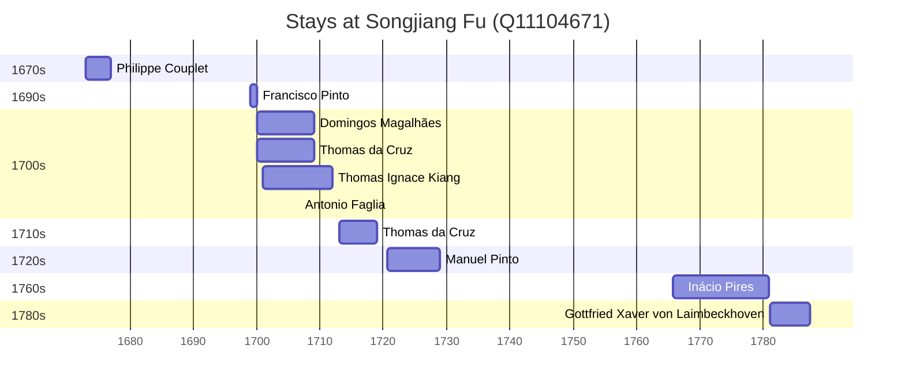

# Songjiang Fu (Q11104671)

*ancient superior prefecture of China*

Wikidata: [Q11104671](https://www.wikidata.org/wiki/Q11104671)

13 occurrence(s) across 5 transcribed value(s), 9 person(s).

**Transcribed variants:**

- `Sungkiang` (9×, 1673–1781)
- `Sungkiang, Kiang-sou` (1×, 1700–1700)
- `Sungkiang (Song-kiang fou)` (1×, 1720–1720)
- `Song-kiang fou` (1×, 1765–1765)
- `T'ang-kia-hiang` (1×, 1787–1787)

| Date | Variant | Person | Type | Entity id | Real entity |
|------|---------|--------|------|-----------|-------------|
| 1673 | Sungkiang | Philippe Couplet | estadia | [deh-philippe-couplet](deh-philippe-couplet) | [rp551005](rp551005) |
| 1699 | Sungkiang | Francisco Pinto | estadia | [deh-francisco-pinto-i](deh-francisco-pinto-i) | — |
| 1700 | Sungkiang | Thomas da Cruz | estadia | [deh-thomas-da-cruz](deh-thomas-da-cruz) | — |
| 1700 | Sungkiang, Kiang-sou | Domingos Magalhães | estadia | [deh-domingos-magalhaes](deh-domingos-magalhaes) | — |
| 1701 | Sungkiang | Thomas Ignace Kiang | estadia | [deh-thomas-ignace-kiang](deh-thomas-ignace-kiang) | — |
| 1706-08-29 | Sungkiang | Antonio Faglia | jesuita-votos-local | [deh-antonio-faglia](deh-antonio-faglia) | — |
| 1713 | Sungkiang | Thomas da Cruz | estadia | [deh-thomas-da-cruz](deh-thomas-da-cruz) | — |
| 1720-08 | Sungkiang (Song-kiang fou) | Manuel Pinto | estadia | [deh-manuel-pinto-iii](deh-manuel-pinto-iii) | — |
| 1722-10-24 | Sungkiang | Domingos Magalhães | morte | [deh-domingos-magalhaes](deh-domingos-magalhaes) | — |
| 1723-08-15 | Sungkiang | Manuel Pinto | jesuita-votos-local | [deh-manuel-pinto-iii](deh-manuel-pinto-iii) | — |
| 1765-10-23 | Song-kiang fou | Inácio Pires | estadia | [deh-inacio-pires](deh-inacio-pires) | — |
| 1781 | Sungkiang | Gottfried Xaver von Laimbeckhoven | estadia | [deh-gottfried-xaver-von-laimbeckhoven](deh-gottfried-xaver-von-laimbeckhoven) | — |
| 1787-05-22 | T'ang-kia-hiang | Gottfried Xaver von Laimbeckhoven | morte | [deh-gottfried-xaver-von-laimbeckhoven](deh-gottfried-xaver-von-laimbeckhoven) | — |

### Co-presence

These persons were plausibly at this place during overlapping periods (interval estimation from stay dates; rough — see method note below).

| Period | Persons |
|--------|---------|
| 1700s | [Antonio Faglia](deh-antonio-faglia), [Domingos Magalhães](deh-domingos-magalhaes), [Thomas Ignace Kiang](deh-thomas-ignace-kiang), [Thomas da Cruz](deh-thomas-da-cruz) |

*6 overlapping pair(s) involving 4 person(s). Method: interval start = stay event date; end = next embarque/partida/different-place event, or death, or +15yr cap.*

