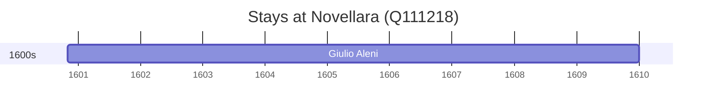

# Novellara (Q111218)

*Italian comune*

Wikidata: [Q111218](https://www.wikidata.org/wiki/Q111218)

1 occurrence(s) across 1 transcribed value(s), 1 person(s).

**Transcribed variants:**

- `Novellara` (1×, 1600–1600)

| Date | Variant | Person | Type | Entity id | Real entity |
|------|---------|--------|------|-----------|-------------|
| 1600-11-01 | Novellara | Giulio Aleni | jesuita-entrada | [deh-giulio-aleni](deh-giulio-aleni) | — |

