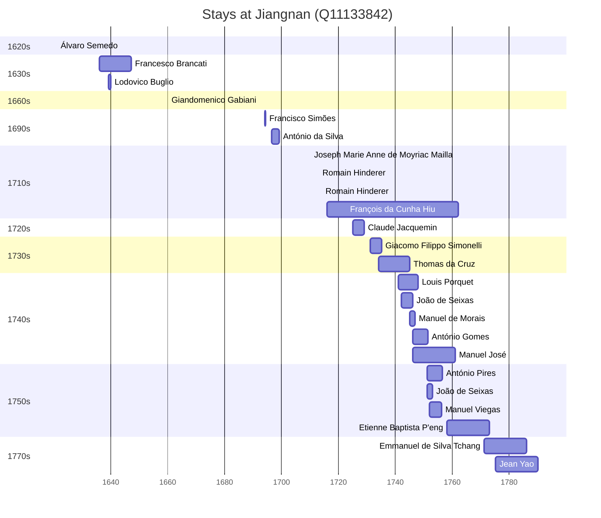

# Jiangnan (Q11133842)

*Province of the Qing Empire covering the area of modern Shanghai, Jiangsu, and Anhui*

Wikidata: [Q11133842](https://www.wikidata.org/wiki/Q11133842)

33 occurrence(s) across 2 transcribed value(s), 27 person(s).

**Transcribed variants:**

- `Kiang-nan` (13×, 1621–1771)
- `Kiangnan` (20×, 1636–1775)

| Date | Variant | Person | Type | Entity id | Real entity |
|------|---------|--------|------|-----------|-------------|
| — | Kiang-nan | Antonio Saverio Morabito | estadia | [deh-antonio-saverio-morabito](deh-antonio-saverio-morabito) | — |
| — | Kiang-nan | Inácio Pires | estadia | [deh-inacio-pires](deh-inacio-pires) | — |
| — | Kiang-nan | José da Silva | estadia | [deh-jose-da-silva](deh-jose-da-silva) | — |
| — | Kiangnan | Louis Porquet | estadia | [deh-louis-porquet](deh-louis-porquet) | [rp585015](rp585015) |
| — | Kiangnan | Pierre K'ieou | estadia | [deh-pierre-kieou](deh-pierre-kieou) | — |
| 1621 | Kiang-nan | Álvaro Semedo | estadia | [deh-alvaro-semedo](deh-alvaro-semedo) | — |
| 1636 | Kiangnan | Francesco Brancati | chegada | [deh-francesco-brancati](deh-francesco-brancati) | — |
| 1639 | Kiang-nan | Lodovico Buglio | estadia | [deh-lodovico-buglio](deh-lodovico-buglio) | — |
| 1660 | Kiangnan | Giandomenico Gabiani | estadia | [deh-giandomenico-gabiani](deh-giandomenico-gabiani) | [rp565060](rp565060) |
| 1694 | Kiang-nan | Francisco Simões | estadia | [deh-francisco-simoes](deh-francisco-simoes) | — |
| 1696-05-04 | Kiang-nan | António da Silva | chegada | [deh-antonio-da-silva](deh-antonio-da-silva) | — |
| 1710 | Kiangnan | Joseph Marie Anne de Moyriac Mailla | estadia | [deh-joseph-marie-anne-de-moyriac-mailla](deh-joseph-marie-anne-de-moyriac-mailla) | — |
| 1713 | Kiangnan | Romain Hinderer | estadia | [deh-romain-hinderer](deh-romain-hinderer) | — |
| 1714 | Kiangnan | Romain Hinderer | estadia | [deh-romain-hinderer](deh-romain-hinderer) | — |
| 1715-12-13 | Kiangnan | François da Cunha Hiu | nascimento | [deh-francois-da-cunha-hiu](deh-francois-da-cunha-hiu) | — |
| 1716 | Kiang-nan | Emmanuel Tchang | nascimento | [deh-emmanuel-tchang-ii](deh-emmanuel-tchang-ii) | [rp840713](rp840713) |
| 1725 | Kiangnan | Claude Jacquemin | estadia | [deh-claude-jacquemin](deh-claude-jacquemin) | — |
| 1731 | Kiang-nan | Giacomo Filippo Simonelli | estadia | [deh-giacomo-filippo-simonelli](deh-giacomo-filippo-simonelli) | — |
| 1734 | Kiangnan | Thomas da Cruz | estadia | [deh-thomas-da-cruz](deh-thomas-da-cruz) | — |
| 1741 | Kiangnan | Louis Porquet | estadia | [deh-louis-porquet](deh-louis-porquet) | [rp585015](rp585015) |
| 1742 | Kiangnan | João de Seixas | estadia | [deh-joao-de-seixas](deh-joao-de-seixas) | — |
| 1745 | Kiangnan | Manuel de Morais | estadia | [deh-manuel-de-morais](deh-manuel-de-morais) | — |
| 1746 | Kiangnan | António Gomes | estadia | [deh-antonio-gomes](deh-antonio-gomes) | — |
| 1746 | Kiangnan | Manuel José | estadia | [deh-manuel-jose](deh-manuel-jose) | — |
| 1748 | Kiangnan | Manuel José | estadia | [deh-manuel-jose](deh-manuel-jose) | — |
| 1750-08-10 | Kiangnan | Pierre K'ieou | morte | [deh-pierre-kieou](deh-pierre-kieou) | — |
| 1751 | Kiangnan | João de Seixas | estadia | [deh-joao-de-seixas](deh-joao-de-seixas) | — |
| 1751 | Kiang-nan | António Pires | estadia | [deh-antonio-pires](deh-antonio-pires) | — |
| 1752 | Kiangnan | Manuel Viegas | chegada | [deh-manuel-viegas](deh-manuel-viegas) | — |
| 1754-05 | Kiang-nan | António Pires | estadia | [deh-antonio-pires](deh-antonio-pires) | — |
| 1758 | Kiang-nan | Etienne Baptista P'eng | estadia | [deh-etienne-baptista-peng](deh-etienne-baptista-peng) | — |
| 1771 | Kiang-nan | Emmanuel de Silva Tchang | estadia | [deh-emmanuel-de-silva-tchang](deh-emmanuel-de-silva-tchang) | [rp840713](rp840713) |
| 1775 | Kiangnan | Jean Yao | estadia | [deh-jean-yao](deh-jean-yao) | — |

### Co-presence

These persons were plausibly at this place during overlapping periods (interval estimation from stay dates; rough — see method note below).

| Period | Persons |
|--------|---------|
| 1630s | [Francesco Brancati](deh-francesco-brancati), [Lodovico Buglio](deh-lodovico-buglio) |
| 1720s | [Claude Jacquemin](deh-claude-jacquemin), [François da Cunha Hiu](deh-francois-da-cunha-hiu) |
| 1730s | [François da Cunha Hiu](deh-francois-da-cunha-hiu), [Giacomo Filippo Simonelli](deh-giacomo-filippo-simonelli), [Thomas da Cruz](deh-thomas-da-cruz) |
| 1740s | [António Gomes](deh-antonio-gomes), [François da Cunha Hiu](deh-francois-da-cunha-hiu), [João de Seixas](deh-joao-de-seixas), [Louis Porquet](rp585015), [Manuel de Morais](deh-manuel-de-morais), [Thomas da Cruz](deh-thomas-da-cruz) |
| 1750s | [António Gomes](deh-antonio-gomes), [António Pires](deh-antonio-pires), [François da Cunha Hiu](deh-francois-da-cunha-hiu), [João de Seixas](deh-joao-de-seixas), [Manuel Viegas](deh-manuel-viegas) |

*24 overlapping pair(s) involving 12 person(s). Method: interval start = stay event date; end = next embarque/partida/different-place event, or death, or +15yr cap.*

