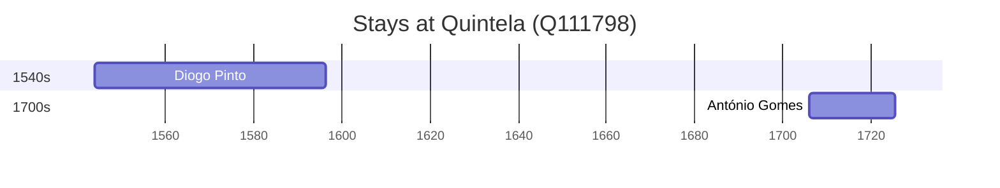

# Quintela (Q111798)

*civil parish in Sernancelhe*

Wikidata: [Q111798](https://www.wikidata.org/wiki/Q111798)

2 occurrence(s) across 2 transcribed value(s), 2 person(s).

**Transcribed variants:**

- `Quintela, diocese de Miranda` (1×, 1544–1544)
- `Quintela da Lapa` (1×, 1706–1706)

| Date | Variant | Person | Type | Entity id | Real entity |
|------|---------|--------|------|-----------|-------------|
| 1544 | Quintela, diocese de Miranda | Diogo Pinto | nascimento | [deh-diogo-pinto](deh-diogo-pinto) | — |
| 1706 | Quintela da Lapa | António Gomes | nascimento | [deh-antonio-gomes](deh-antonio-gomes) | — |

