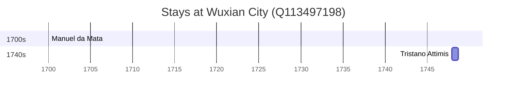

# Wuxian City (Q113497198)

*former city in Jiangsu, China*

Wikidata: [Q113497198](https://www.wikidata.org/wiki/Q113497198)

4 occurrence(s) across 4 transcribed value(s), 4 person(s).

**Transcribed variants:**

- `Tch'ang-chou` (1×, 1676–1676)
- `Changshu (Tch'ang-chou)` (1×, 1700–1700)
- `Changshu (Tch'ang-chou) do Soochow fou` (1×, 1744–1744)
- `Tch'ang-chou, Changshu (igreja de Tong ko)` (1×, 1747–1747)

| Date | Variant | Person | Type | Entity id | Real entity |
|------|---------|--------|------|-----------|-------------|
| 1676-11-09 | Tch'ang-chou | François de Rougemont | morte | [deh-francois-de-rougemont](deh-francois-de-rougemont) | — |
| 1700 | Changshu (Tch'ang-chou) | Manuel da Mata | estadia | [deh-manuel-da-mata](deh-manuel-da-mata) | — |
| 1744-08-26 | Changshu (Tch'ang-chou) do Soochow fou | Romain Hinderer | morte | [deh-romain-hinderer](deh-romain-hinderer) | — |
| 1747-12-11 | Tch'ang-chou, Changshu (igreja de Tong ko) | Tristano Attimis | estadia | [deh-tristano-attimis](deh-tristano-attimis) | — |

