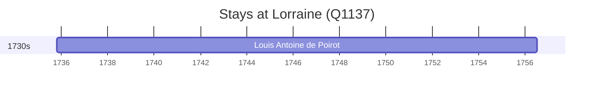

# Lorraine (Q1137)

*cultural region in France*

Wikidata: [Q1137](https://www.wikidata.org/wiki/Q1137)

1 occurrence(s) across 1 transcribed value(s), 1 person(s).

**Transcribed variants:**

- `Lorraine` (1×, 1735–1735)

| Date | Variant | Person | Type | Entity id | Real entity |
|------|---------|--------|------|-----------|-------------|
| 1735-10-23 | Lorraine | Louis Antoine de Poirot | nascimento | [deh-louis-antoine-de-poirot](deh-louis-antoine-de-poirot) | — |

