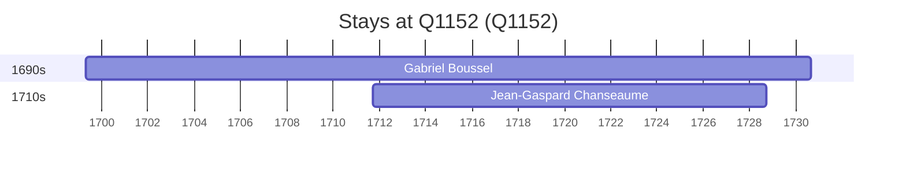

# Q1152

*(fetch error: HTTP Error 429: Too Many Requests)*

Wikidata: [Q1152](https://www.wikidata.org/wiki/Q1152)

2 occurrence(s) across 2 transcribed value(s), 2 person(s).

**Transcribed variants:**

- `Diocese de Clermont, Auvergne` (1×, 1699–1699)
- `Auvergne` (1×, 1711–1711)

| Date | Variant | Person | Type | Entity id | Real entity |
|------|---------|--------|------|-----------|-------------|
| 1699-04-23 | Diocese de Clermont, Auvergne | Gabriel Boussel | nascimento | [deh-gabriel-boussel](deh-gabriel-boussel) | [rp796803](rp796803) |
| 1711-09-12 | Auvergne | Jean-Gaspard Chanseaume | nascimento | [deh-jean-gaspard-chanseaume](deh-jean-gaspard-chanseaume) | — |

### Co-presence

These persons were plausibly at this place during overlapping periods (interval estimation from stay dates; rough — see method note below).

| Period | Persons |
|--------|---------|
| 1710s | [Gabriel Boussel](rp796803), [Jean-Gaspard Chanseaume](deh-jean-gaspard-chanseaume) |

*1 overlapping pair(s) involving 2 person(s). Method: interval start = stay event date; end = next embarque/partida/different-place event, or death, or +15yr cap.*

