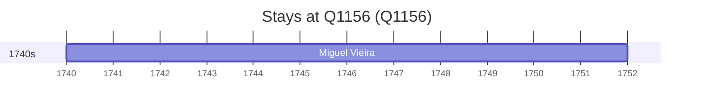

# Q1156

*(fetch error: HTTP Error 429: Too Many Requests)*

Wikidata: [Q1156](https://www.wikidata.org/wiki/Q1156)

1 occurrence(s) across 1 transcribed value(s), 1 person(s).

**Transcribed variants:**

- `Bombaim` (1×, 1740–1740)

| Date | Variant | Person | Type | Entity id | Real entity |
|------|---------|--------|------|-----------|-------------|
| 1740 | Bombaim | Miguel Vieira | estadia | [deh-miguel-vieira](deh-miguel-vieira) | — |

