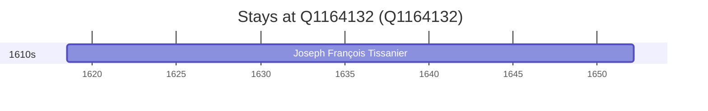

# Q1164132

*(fetch error: HTTP Error 429: Too Many Requests)*

Wikidata: [Q1164132](https://www.wikidata.org/wiki/Q1164132)

1 occurrence(s) across 1 transcribed value(s), 1 person(s).

**Transcribed variants:**

- `Port-Sainte-Marie` (1×, 1618–1618)

| Date | Variant | Person | Type | Entity id | Real entity |
|------|---------|--------|------|-----------|-------------|
| 1618-07 | Port-Sainte-Marie | Joseph François Tissanier | nascimento | [deh-joseph-francois-tissanier](deh-joseph-francois-tissanier) | — |

