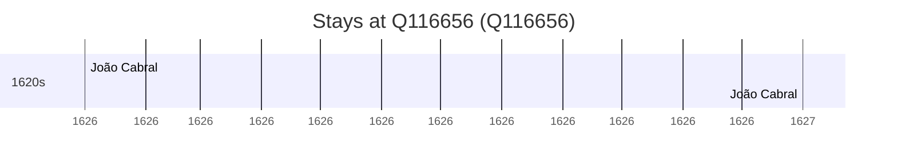

# Q116656

*(fetch error: HTTP Error 429: Too Many Requests)*

Wikidata: [Q116656](https://www.wikidata.org/wiki/Q116656)

2 occurrence(s) across 1 transcribed value(s), 1 person(s).

**Transcribed variants:**

- `Shigatse, Tibete` (2×, 1626–1627)

| Date | Variant | Person | Type | Entity id | Real entity |
|------|---------|--------|------|-----------|-------------|
| 1626 | Shigatse, Tibete | João Cabral | estadia | [deh-joao-cabral](deh-joao-cabral) | — |
| 1627 | Shigatse, Tibete | João Cabral | estadia | [deh-joao-cabral](deh-joao-cabral) | — |

