# Goa (Q1171)

*state in western India*

Wikidata: [Q1171](https://www.wikidata.org/wiki/Q1171)

278 occurrence(s) across 13 transcribed value(s), 185 person(s).

**Transcribed variants:**

- `Goa` (254×, 1542–1786)
- `Goa (colégio)` (3×, 1566–1734)
- `Goa (igreja de S. Paulo)` (1×, 1568–1568)
- `Goa (Colégio Novo)` (1×, 1613–1613)
- `Goa (colégio de S. Paulo o Novo)` (1×, 1647–1647)
- `Goa (casa professa)` (6×, 1650–1740)
- `[No mar, perto de Goa]` (3×, 1651–1693)
- `?` (3×, 1694–1746)
- `Goa, Índia` (1×, 1695–1695)
- `província de Goa` (1×, 1695–1695)
- `Goa (noviciado)` (2×, 1702–1726)
- `Goa (Colégio)` (1×, undated)
- `Kwangtung` (1×, undated)

| Date                    | Variant                          | Person                            | Type                    | Entity id                                                                              | Real entity          |
| ----------------------- | -------------------------------- | --------------------------------- | ----------------------- | -------------------------------------------------------------------------------------- | -------------------- |
| —                       | Goa                              | Baltasar Diego da Rocha           | estadia                 | [deh-baltasar-diego-da-rocha](deh-baltasar-diego-da-rocha)                             | —                    |
| —                       | Goa                              | Baltasar Gago                     | estadia                 | [deh-baltasar-gago](deh-baltasar-gago)                                                 | —                    |
| —                       | Goa                              | Estêvão de Góis                   | estadia                 | [deh-estevao-de-gois](deh-estevao-de-gois)                                             | —                    |
| —                       | Goa                              | Francisco Pérez                   | estadia                 | [deh-francisco-perez](deh-francisco-perez)                                             | [rp892854](rp892854) |
| —                       | Goa                              | Francisco Vieira                  | estadia                 | [deh-francisco-vieira](deh-francisco-vieira)                                           | —                    |
| —                       | Goa                              | Gerard Arnould Rijckewaert        | estadia                 | [deh-gerard-arnould-rijckewaert](deh-gerard-arnould-rijckewaert)                       | —                    |
| —                       | Goa                              | Giuseppe Candone                  | estadia                 | [deh-giuseppe-candone](deh-giuseppe-candone)                                           | —                    |
| —                       | Goa                              | Gottfried Xaver von Laimbeckhoven | estadia                 | [deh-gottfried-xaver-von-laimbeckhoven](deh-gottfried-xaver-von-laimbeckhoven)         | —                    |
| —                       | Goa                              | Gregório Seco                     | estadia                 | [deh-gregorio-seco](deh-gregorio-seco)                                                 | —                    |
| —                       | Goa                              | Jean Sylvain de Neuvialle         | estadia                 | [deh-jean-sylvain-de-neuvialle](deh-jean-sylvain-de-neuvialle)                         | —                    |
| —                       | Goa                              | João Cabral                       | estadia                 | [deh-joao-cabral](deh-joao-cabral)                                                     | —                    |
| —                       | Goa                              | João Fróis                        | estadia                 | [deh-joao-frois](deh-joao-frois)                                                       | —                    |
| —                       | Goa                              | Luís da Gama                      | estadia                 | [deh-luis-da-gama](deh-luis-da-gama)                                                   | —                    |
| —                       | Goa                              | Manuel de Sá                      | estadia                 | [deh-manuel-de-sa](deh-manuel-de-sa)                                                   | —                    |
| —                       | Goa                              | Manuel de Sousa                   | estadia                 | [deh-manuel-de-sousa](deh-manuel-de-sousa)                                             | —                    |
| —                       | Goa                              | Manuel Dias, o Velho              | estadia                 | [deh-manuel-dias-o-velho](deh-manuel-dias-o-velho)                                     | —                    |
| —                       | Goa                              | Matias de Sousa                   | estadia                 | [deh-matias-de-sousa](deh-matias-de-sousa)                                             | —                    |
| —                       | Goa                              | Nicolau da Fonseca                | estadia                 | [deh-nicolau-da-fonseca](deh-nicolau-da-fonseca)                                       | —                    |
| —                       | Goa                              | Francisco Xavier                  | estadia                 | [deh-pedro-de-alcacova-ref1](deh-pedro-de-alcacova-ref1)                               | —                    |
| 1542-05-06              | Goa                              | Francisco Xavier                  | estadia                 | [deh-francisco-xavier](deh-francisco-xavier)                                           | —                    |
| 1543-12                 | Goa                              | Francisco Xavier                  | jesuita-votos-local     | [deh-francisco-xavier](deh-francisco-xavier)                                           | —                    |
| 1548                    | Goa                              | António Vaz                       | jesuita-entrada         | [deh-antonio-vaz-ref1](deh-antonio-vaz-ref1)                                           | —                    |
| 1548-05-02              | Goa                              | Pedro de Alcáçova                 | jesuita-entrada         | [deh-pedro-de-alcacova](deh-pedro-de-alcacova)                                         | —                    |
| 1548-11-25              | Goa                              | Álvaro Ferreira                   | jesuita-entrada         | [deh-alvaro-ferreira](deh-alvaro-ferreira)                                             | —                    |
| 1549                    | Goa                              | Cosmas Torres                     | jesuita-entrada         | [deh-cosmas-torres](deh-cosmas-torres)                                                 | —                    |
| 1551-09                 | Goa                              | Manuel Teixeira                   | estadia                 | [deh-manuel-teixeira](deh-manuel-teixeira)                                             | [rp212210](rp212210) |
| 1552-02                 | Goa                              | Manuel Teixeira                   | estadia                 | [deh-manuel-teixeira](deh-manuel-teixeira)                                             | [rp212210](rp212210) |
| 1552-02                 | Goa                              | Francisco Xavier                  | estadia                 | [deh-manuel-teixeira-ref1](deh-manuel-teixeira-ref1)                                   | —                    |
| 1552-04                 | Goa                              | Manuel Teixeira                   | estadia                 | [deh-manuel-teixeira](deh-manuel-teixeira)                                             | [rp212210](rp212210) |
| 1552-04                 | Goa                              | Francisco Xavier                  | estadia                 | [deh-manuel-teixeira-ref1](deh-manuel-teixeira-ref1)                                   | —                    |
| 1553                    | Goa                              | Manuel Teixeira                   | estadia                 | [deh-manuel-teixeira](deh-manuel-teixeira)                                             | [rp212210](rp212210) |
| 1554                    | Goa                              | Fernão Mendes Pinto               | jesuita-entrada         | [deh-fernao-mendes-pinto](deh-fernao-mendes-pinto)                                     | —                    |
| 1554-02                 | Goa                              | Estêvão de Góis                   | jesuita-entrada         | [deh-estevao-de-gois](deh-estevao-de-gois)                                             | —                    |
| 1555                    | Goa                              | Pedro de Alcáçova                 | estadia                 | [deh-pedro-de-alcacova](deh-pedro-de-alcacova)                                         | —                    |
| 1555-09-06              | Goa                              | Belchior Miguel Carneiro Leitão   | chegada                 | [deh-belchior-miguel-carneiro-leitao](deh-belchior-miguel-carneiro-leitao)             | [rp973077](rp973077) |
| 1556-03                 | Goa                              | Gaspar Coelho                     | jesuita-entrada         | [deh-gaspar-coelho](deh-gaspar-coelho)                                                 | —                    |
| 1557                    | Goa                              | Luís de Mendanha                  | jesuita-entrada         | [deh-luis-de-mendanha](deh-luis-de-mendanha)                                           | —                    |
| 1557-05                 | Goa                              | André Pinto                       | jesuita-entrada         | [deh-andre-pinto](deh-andre-pinto)                                                     | —                    |
| 1557-09-21              | Goa                              | Belchior Nunes Barreto            | jesuita-votos-local     | [deh-belchior-nunes-barreto](deh-belchior-nunes-barreto)                               | [rp606650](rp606650) |
| 1558                    | Goa                              | Francisco Cabral                  | chegada                 | [deh-francisco-cabral](deh-francisco-cabral)                                           | [rp400649](rp400649) |
| 1558                    | Goa                              | Antonio Díaz                      | estadia                 | [deh-antonio-diaz](deh-antonio-diaz)                                                   | —                    |
| 1559                    | Goa                              | António Vaz                       | jesuita-entrada         | [deh-antonio-vaz-ref1](deh-antonio-vaz-ref1)                                           | —                    |
| 1560                    | Goa                              | Manuel Teixeira                   | estadia                 | [deh-manuel-teixeira](deh-manuel-teixeira)                                             | [rp212210](rp212210) |
| 1560                    | Goa                              | Manuel Teixeira                   | jesuita-ordenacao-padre | [deh-manuel-teixeira](deh-manuel-teixeira)                                             | [rp212210](rp212210) |
| 1561                    | Goa                              | António Vaz                       | estadia                 | [deh-antonio-vaz-ref1](deh-antonio-vaz-ref1)                                           | —                    |
| 1561-09                 | Goa                              | Giovanni Battista De Monte        | jesuita-ordenacao-padre | [deh-giovanni-battista-de-monte](deh-giovanni-battista-de-monte)                       | —                    |
| 1562                    | Goa                              | Melchior Dias                     | jesuita-ordenacao-padre | [deh-melchor-diaz-ref1](deh-melchor-diaz-ref1)                                         | —                    |
| 1563-04-27              | Goa                              | Manuel Teixeira                   | estadia                 | [deh-manuel-teixeira](deh-manuel-teixeira)                                             | [rp212210](rp212210) |
| 1563-04-27              | Goa                              | Francisco Pérez                   | partida                 | [deh-manuel-teixeira-ref2](deh-manuel-teixeira-ref2)                                   | —                    |
| 1565                    | Goa                              | Alessandro Valla                  | estadia                 | [deh-alessandro-valla](deh-alessandro-valla)                                           | —                    |
| 1565                    | Goa                              | António Pais                      | estadia                 | [deh-antonio-pais](deh-antonio-pais)                                                   | —                    |
| 1565                    | Goa                              | Pedro Argudo                      | jesuita-entrada         | [deh-pedro-martins-ref3](deh-pedro-martins-ref3)                                       | —                    |
| 1566                    | Goa (colégio)                    | Gonçalo Dias                      | estadia                 | [deh-goncalo-dias-ref1](deh-goncalo-dias-ref1)                                         | —                    |
| 1566                    | Goa                              | Hernando de Alcaraz               | estadia                 | [deh-hernando-de-alcaraz](deh-hernando-de-alcaraz)                                     | —                    |
| 1567                    | Goa                              | António Vaz                       | estadia                 | [deh-antonio-vaz-ref1](deh-antonio-vaz-ref1)                                           | —                    |
| 1567                    | Goa                              | Organtino Gnecchi-Soldo           | estadia                 | [deh-organtino-gnecchi-soldo](deh-organtino-gnecchi-soldo)                             | —                    |
| 1567                    | Goa                              | Belchior Nunes Barreto            | estadia                 | [deh-belchior-nunes-barreto](deh-belchior-nunes-barreto)                               | [rp606650](rp606650) |
| 1568                    | Goa                              | Francisco Pérez                   | estadia                 | [deh-francisco-perez](deh-francisco-perez)                                             | [rp892854](rp892854) |
| 1568                    | Goa                              | Manuel Teixeira                   | estadia                 | [deh-manuel-teixeira](deh-manuel-teixeira)                                             | [rp212210](rp212210) |
| 1568-11-30              | Goa (igreja de S. Paulo)         | André Fernandes                   | jesuita-votos-local     | [deh-andre-fernandes-i](deh-andre-fernandes-i)                                         | —                    |
| 1568-11-30              | Goa                              | Manuel Teixeira                   | jesuita-votos-local     | [deh-manuel-teixeira](deh-manuel-teixeira)                                             | [rp212210](rp212210) |
| 1568-11-30              | Goa                              | Organtino Gnecchi-Soldo           | jesuita-votos-local     | [deh-organtino-gnecchi-soldo](deh-organtino-gnecchi-soldo)                             | —                    |
| 1568-12                 | Goa                              | Gonçalo Álvares                   | estadia                 | [deh-goncalo-alvares](deh-goncalo-alvares)                                             | [rp127859](rp127859) |
| 1569                    | Goa                              | André Pinto                       | estadia                 | [deh-andre-pinto](deh-andre-pinto)                                                     | —                    |
| 1571-08-10              | Goa                              | Belchior Nunes Barreto            | morte                   | [deh-belchior-nunes-barreto](deh-belchior-nunes-barreto)                               | [rp606650](rp606650) |
| 1572-11-21              | Goa                              | Tibúrcio de Quadros               | morte                   | [deh-tiburcio-de-quadros](deh-tiburcio-de-quadros)                                     | —                    |
| 1574                    | Goa                              | Fernão Martins                    | jesuita-ordenacao-padre | [deh-fernao-martins](deh-fernao-martins)                                               | —                    |
| 1574                    | Goa                              | Melchior Mora                     | jesuita-ordenacao-padre | [deh-melchior-mora](deh-melchior-mora)                                                 | —                    |
| 1574-04                 | Goa                              | Diogo de Mesquita                 | jesuita-entrada         | [deh-diogo-de-mesquita](deh-diogo-de-mesquita)                                         | —                    |
| 1574-09-06              | Goa                              | Alessandro Valignano              | chegada                 | [deh-alessandro-valignano](deh-alessandro-valignano)                                   | —                    |
| 1578-09-13              | Goa                              | Francesco Pasio                   | estadia                 | [deh-francesco-pasio](deh-francesco-pasio)                                             | —                    |
| 1578-09-13              | Goa                              | Matteo Ricci                      | chegada                 | [deh-matteo-ricci](deh-matteo-ricci)                                                   | [rp302155](rp302155) |
| 1579                    | Goa                              | Manuel Teixeira                   | estadia                 | [deh-manuel-teixeira](deh-manuel-teixeira)                                             | [rp212210](rp212210) |
| 1579-01-13              | Goa                              | Francisco Pires                   | jesuita-entrada         | [deh-francisco-pires](deh-francisco-pires)                                             | —                    |
| 1579-12                 | Goa                              | António de Abreu                  | jesuita-entrada         | [deh-antonio-de-abreu](deh-antonio-de-abreu)                                           | [rp796356](rp796356) |
| 1580                    | Goa                              | Simón Antunez                     | morte                   | [deh-simao-antunes-ref2](deh-simao-antunes-ref2)                                       | —                    |
| 1582-04-26              | Goa                              | Francesco Pasio                   | estadia                 | [deh-francesco-pasio](deh-francesco-pasio)                                             | —                    |
| 1583-01-09              | Goa                              | Baltasar Gago                     | morte                   | [deh-baltasar-gago](deh-baltasar-gago)                                                 | —                    |
| 1583-11-10              | Goa                              | Alessandro Valignano              | chegada                 | [deh-alessandro-valignano](deh-alessandro-valignano)                                   | —                    |
| 1584                    | Goa                              | Theodor Mantels                   | estadia                 | [deh-theodor-mantels](deh-theodor-mantels)                                             | —                    |
| 1584-01-15              | Goa                              | Duarte de Sande                   | jesuita-votos-local     | [deh-duarte-de-sande](deh-duarte-de-sande)                                             | —                    |
| 1585-03-25              | Goa                              | António de Almeida                | jesuita-ordenacao-padre | [deh-antonio-de-almeida](deh-antonio-de-almeida)                                       | —                    |
| 1585-05-01              | Goa                              | Duarte de Sande                   | estadia                 | [deh-duarte-de-sande](deh-duarte-de-sande)                                             | —                    |
| 1586-09-24              | Goa                              | Pedro Martins                     | chegada                 | [deh-pedro-martins](deh-pedro-martins)                                                 | —                    |
| 1586-12                 | Goa                              | Francisco Cabral                  | estadia                 | [deh-francisco-cabral](deh-francisco-cabral)                                           | [rp400649](rp400649) |
| 1586-12                 | Goa                              | Francisco Cabral                  | partida                 | [deh-francisco-cabral](deh-francisco-cabral)                                           | [rp400649](rp400649) |
| 1587-05-29              | Goa                              | Francesco De Petris               | chegada                 | [deh-francesco-de-petris](deh-francesco-de-petris)                                     | —                    |
| 1588-04-22              | Goa                              | Francesco De Petris               | estadia                 | [deh-francesco-de-petris](deh-francesco-de-petris)                                     | —                    |
| 1589                    | Goa                              | Lazzaro Cattaneo                  | chegada                 | [deh-lazzaro-cattaneo](deh-lazzaro-cattaneo)                                           | —                    |
| 1590-03-19              | Goa                              | Manuel Teixeira                   | estadia                 | [deh-manuel-teixeira](deh-manuel-teixeira)                                             | [rp212210](rp212210) |
| 1590-03-19              | Goa                              | Manuel Teixeira                   | morte                   | [deh-manuel-teixeira](deh-manuel-teixeira)                                             | [rp212210](rp212210) |
| 1592-02-17              | Goa                              | Pedro Martins                     | estadia                 | [deh-pedro-martins](deh-pedro-martins)                                                 | —                    |
| 1595-03-04              | Goa                              | Alessandro Valignano              | estadia                 | [deh-alessandro-valignano](deh-alessandro-valignano)                                   | —                    |
| 1595-07-09              | Goa                              | Francisco Vieira                  | jesuita-votos-local     | [deh-francisco-vieira](deh-francisco-vieira)                                           | —                    |
| 1595-07-09              | Goa                              | Manuel Dias, o Velho              | jesuita-votos-local     | [deh-manuel-dias-o-velho](deh-manuel-dias-o-velho)                                     | —                    |
| 1596-09                 | Goa                              | Nicolau Pimenta                   | estadia                 | [deh-nicolau-pimenta](deh-nicolau-pimenta)                                             | —                    |
| 1598-03-22              | Goa                              | André Fernandes                   | morte                   | [deh-andre-fernandes-i](deh-andre-fernandes-i)                                         | —                    |
| 1598-05-01              | Goa                              | Gil Martínez de la Mata           | estadia                 | [deh-gil-martinez-de-la-mata](deh-gil-martinez-de-la-mata)                             | —                    |
| 1600                    | Goa                              | Bartolomeo Tedeschi               | jesuita-ordenacao-padre | [deh-bartolomeo-tedeschi](deh-bartolomeo-tedeschi)                                     | [rp086162](rp086162) |
| 1600                    | Goa                              | Pedro Marques, sénior             | estadia                 | [deh-pedro-marques-senior](deh-pedro-marques-senior)                                   | —                    |
| 1600-09                 | Goa                              | Bartolomeo Tedeschi               | chegada                 | [deh-bartolomeo-tedeschi](deh-bartolomeo-tedeschi)                                     | [rp086162](rp086162) |
| 1601                    | Goa                              | Muzio Rocchi                      | estadia                 | [deh-muzio-rocchi](deh-muzio-rocchi)                                                   | —                    |
| 1601                    | Goa                              | Manuel Dias, o Novo               | estadia                 | [deh-manuel-dias-o-novo](deh-manuel-dias-o-novo)                                       | —                    |
| 1601-04-19              | Goa                              | Manuel Gaspar                     | jesuita-votos-local     | [deh-manuel-gaspar](deh-manuel-gaspar)                                                 | —                    |
| 1603-09-15              | Goa                              | Giovanni Antonio Rubino           | chegada                 | [deh-giovanni-antonio-rubino](deh-giovanni-antonio-rubino)                             | —                    |
| 1605                    | Goa                              | Giovanni Antonio Rubino           | jesuita-ordenacao-padre | [deh-giovanni-antonio-rubino](deh-giovanni-antonio-rubino)                             | —                    |
| 1609-04-16              | Goa                              | Francisco Cabral                  | morte                   | [deh-francisco-cabral](deh-francisco-cabral)                                           | [rp400649](rp400649) |
| 1612-10-14              | Goa                              | António de Andrade                | jesuita-votos-local     | [deh-antonio-de-andrade](deh-antonio-de-andrade)                                       | —                    |
| 1613-03-06              | Goa (Colégio Novo)               | Nicolau Pimenta                   | morte                   | [deh-nicolau-pimenta](deh-nicolau-pimenta)                                             | —                    |
| 1618-10-18              | Goa                              | Elie (Philippe) Trigault          | morte                   | [deh-eli-philippe-trigault](deh-eli-philippe-trigault)                                 | —                    |
| 1619-02-01              | Goa                              | Gaspar Luís                       | estadia                 | [deh-gaspar-luis](deh-gaspar-luis)                                                     | —                    |
| 1619-05                 | Goa                              | Nicolas Trigault                  | estadia                 | [deh-nicolas-trigault](deh-nicolas-trigault)                                           | —                    |
| 1620                    | Goa                              | Rui de Figueiredo                 | jesuita-ordenacao-padre | [deh-rui-de-figueiredo](deh-rui-de-figueiredo)                                         | —                    |
| 1620-02-01              | Goa                              | Gaspar Luís                       | estadia                 | [deh-gaspar-luis](deh-gaspar-luis)                                                     | —                    |
| 1621-02-01              | Goa                              | António Francisco Cardim          | jesuita-ordenacao-padre | [deh-antonio-francisco-cardim](deh-antonio-francisco-cardim)                           | [rp536947](rp536947) |
| 1624                    | Goa                              | António de Gouveia                | estadia                 | [deh-antonio-de-gouvea](deh-antonio-de-gouvea)                                         | —                    |
| 1624-10-20              | Goa                              | Alano dos Anjos                   | jesuita-votos-local     | [deh-alano-dos-anjos](deh-alano-dos-anjos)                                             | —                    |
| 1625                    | Goa                              | Valentim de Carvalho              | partida                 | [deh-valentim-de-carvalho](deh-valentim-de-carvalho)                                   | —                    |
| 1625-02-13              | Goa                              | Alano dos Anjos                   | estadia                 | [deh-alano-dos-anjos](deh-alano-dos-anjos)                                             | —                    |
| 1630-12                 | Goa                              | Valentim de Carvalho              | morte                   | [deh-valentim-de-carvalho](deh-valentim-de-carvalho)                                   | —                    |
| 1634                    | Goa                              | Gabriel de Magalhães              | estadia                 | [deh-gabriel-de-magalhaes](deh-gabriel-de-magalhaes)                                   | [rp695666](rp695666) |
| 1634-03-19              | Goa                              | António de Andrade                | morte                   | [deh-antonio-de-andrade](deh-antonio-de-andrade)                                       | —                    |
| 1637                    | Goa                              | Sebastião de Almeida              | jesuita-entrada         | [deh-sebastiao-de-almeida](deh-sebastiao-de-almeida)                                   | —                    |
| 1640-11-02              | Goa                              | Giovanni Filippo De Marini        | estadia                 | [deh-giovanni-filippo-de-marini](deh-giovanni-filippo-de-marini)                       | —                    |
| 1641                    | Goa                              | Manuel Henriques                  | jesuita-entrada         | [deh-manuel-henriques](deh-manuel-henriques)                                           | —                    |
| 1641                    | Goa                              | Simão Martins                     | jesuita-entrada         | [deh-simao-martins](deh-simao-martins)                                                 | —                    |
| 1642-01                 | Goa                              | Andreas Wolfgang Koffler          | chegada                 | [deh-andreas-wolfgang-koffler](deh-andreas-wolfgang-koffler)                           | —                    |
| 1642-02-02              | Goa                              | Gaspar Luís                       | partida                 | [deh-gaspar-luis](deh-gaspar-luis)                                                     | —                    |
| 1647                    | Goa (colégio de S. Paulo o Novo) | Feliciano Pacheco                 | estadia                 | [deh-feliciano-pacheco](deh-feliciano-pacheco)                                         | —                    |
| 1647-10-01              | Goa                              | Luís da Gama                      | jesuita-votos-local     | [deh-luis-da-gama](deh-luis-da-gama)                                                   | —                    |
| 1649-10-14              | Goa                              | Francisco Nogueira                | jesuita-entrada         | [deh-francisco-nogueira](deh-francisco-nogueira)                                       | —                    |
| 1650-03-25              | Goa (casa professa)              | Gianbattista Brandi               | jesuita-votos-local     | [deh-gianbattista-brandi](deh-gianbattista-brandi)                                     | —                    |
| 1650-03-25              | Goa                              | Matias da Maia                    | jesuita-votos-local     | [deh-matias-da-maia](deh-matias-da-maia)                                               | —                    |
| 1650-05                 | Goa                              | António Francisco Cardim          | chegada                 | [deh-antonio-francisco-cardim](deh-antonio-francisco-cardim)                           | [rp536947](rp536947) |
| 1651-01-01              | Goa                              | Michael-Pierre Boym               | partida                 | [deh-michael-pierre-boym](deh-michael-pierre-boym)                                     | —                    |
| 1651-05                 | Goa                              | Michael-Pierre Boym               | chegada                 | [deh-michael-pierre-boym](deh-michael-pierre-boym)                                     | —                    |
| 1651-12-03              | [No mar, perto de Goa]           | Baldassare Citadella              | morte                   | [deh-baldassare-citadella](deh-baldassare-citadella)                                   | —                    |
| 1651-12-03              | [No mar, perto de Goa]           | Ignace Lagot                      | morte                   | [deh-ignace-lagot](deh-ignace-lagot)                                                   | —                    |
| 1652-09-08              | Goa                              | Pedro Zuzarte                     | jesuita-votos-local     | [deh-pedro-zuzarte](deh-pedro-zuzarte)                                                 | —                    |
| 1655                    | Goa                              | Tomé Vaz                          | estadia                 | [deh-tome-vaz](deh-tome-vaz)                                                           | —                    |
| 1655-08-21              | Goa                              | Christophe Cloche                 | chegada                 | [deh-christophe-cloche](deh-christophe-cloche)                                         | —                    |
| 1655-08-21              | Goa                              | Edmond Poncet                     | chegada                 | [deh-edmond-poncet](deh-edmond-poncet)                                                 | —                    |
| 1656                    | Goa                              | Domenico Fuciti                   | estadia                 | [deh-domenico-fuciti](deh-domenico-fuciti)                                             | —                    |
| 1656-11-06              | Goa                              | Ignatus Hartogvelt                | chegada                 | [deh-ignatus-hartogvelt](deh-ignatus-hartogvelt)                                       | —                    |
| 1658                    | Goa                              | Jean Brandi                       | morte                   | [deh-jean-brandi](deh-jean-brandi)                                                     | —                    |
| 1659-12-02              | Goa                              | Sebastião de Almeida              | jesuita-votos-local     | [deh-sebastiao-de-almeida](deh-sebastiao-de-almeida)                                   | —                    |
| 1660                    | Goa                              | João de Abreu                     | estadia                 | [deh-joao-de-abreu](deh-joao-de-abreu)                                                 | —                    |
| 1660                    | Goa                              | João de Figueiredo                | estadia                 | [deh-joao-de-figueiredo](deh-joao-de-figueiredo)                                       | —                    |
| 1660                    | Goa                              | António Preto                     | estadia                 | [deh-antonio-preto](deh-antonio-preto)                                                 | —                    |
| 1660                    | Goa                              | Franz Xavier                      | estadia                 | [deh-franz-xavier](deh-franz-xavier)                                                   | —                    |
| 1660                    | Goa                              | João Brandi                       | estadia                 | [deh-jean-brandi-ref1](deh-jean-brandi-ref1)                                           | —                    |
| 1660                    | Goa                              | Simão Martins                     | jesuita-votos-local     | [deh-simao-martins](deh-simao-martins)                                                 | —                    |
| 1660-10-13              | Goa                              | António Preto                     | morte                   | [deh-antonio-preto](deh-antonio-preto)                                                 | —                    |
| 1661-06-13              | Goa                              | Alessandro Fillippucci            | chegada                 | [deh-alessandro-fillippucci](deh-alessandro-fillippucci)                               | —                    |
| 1662                    | Goa                              | Gonçalo Martins                   | estadia                 | [deh-goncalo-martins](deh-goncalo-martins)                                             | —                    |
| 1662-12-08              | Goa                              | André Gomes                       | jesuita-votos-local     | [deh-andre-gomes](deh-andre-gomes)                                                     | —                    |
| 1663                    | Goa                              | Manuel de Pereira                 | estadia                 | [deh-manuel-de-pereira-ii](deh-manuel-de-pereira-ii)                                   | —                    |
| 1664                    | Goa                              | Gonçalo Martins                   | estadia                 | [deh-goncalo-martins](deh-goncalo-martins)                                             | —                    |
| 1665-04-29              | Goa                              | António Rodrigues                 | morte                   | [deh-antonio-rodrigues-ii](deh-antonio-rodrigues-ii)                                   | —                    |
| 1666                    | Goa                              | Mauro de Azevedo                  | jesuita-entrada         | [deh-mauro-de-azevedo](deh-mauro-de-azevedo)                                           | —                    |
| 1666-04-19              | Goa                              | Filippo-Maria Fieschi             | estadia                 | [deh-filippo-maria-fieschi](deh-filippo-maria-fieschi)                                 | —                    |
| 1666-10-13              | Goa                              | Giovanni Filippo De Marini        | chegada                 | [deh-giovanni-filippo-de-marini](deh-giovanni-filippo-de-marini)                       | —                    |
| 1667                    | Goa                              | João de Figueiredo                | estadia                 | [deh-joao-de-figueiredo](deh-joao-de-figueiredo)                                       | —                    |
| 1668-05-14              | Goa                              | Manuel de Siqueira Tcheng         | estadia                 | [deh-manuel-de-siqueira-tcheng](deh-manuel-de-siqueira-tcheng)                         | [rp166098](rp166098) |
| 1668-12-12              | Goa                              | Filippo-Maria Fieschi             | chegada                 | [deh-filippo-maria-fieschi](deh-filippo-maria-fieschi)                                 | —                    |
| 1669-07-04              | Goa                              | João Cabral                       | morte                   | [deh-joao-cabral](deh-joao-cabral)                                                     | —                    |
| 1672-04-20              | Goa                              | Nicolau Rodrigues                 | jesuita-entrada         | [deh-nicolau-rodrigues](deh-nicolau-rodrigues)                                         | —                    |
| 1673                    | Goa                              | Diogo de Sotomaior                | estadia                 | [deh-diogo-de-sotomaior](deh-diogo-de-sotomaior)                                       | —                    |
| 1673                    | Goa                              | Tomé Vaz                          | estadia                 | [deh-tome-vaz](deh-tome-vaz)                                                           | —                    |
| 1673-11-28              | Goa                              | João de Figueiredo                | morte                   | [deh-joao-de-figueiredo](deh-joao-de-figueiredo)                                       | —                    |
| 1675-08-15              | Goa (casa professa)              | Diogo de Sotomaior                | jesuita-votos-local     | [deh-diogo-de-sotomaior](deh-diogo-de-sotomaior)                                       | —                    |
| 1676-02-27              | Goa                              | Francesco Leonardo Cinamo         | morte                   | [deh-francesco-leonardo-cinamo](deh-francesco-leonardo-cinamo)                         | —                    |
| 1680-09-26              | Goa                              | Antoine Thomas                    | chegada                 | [deh-antoine-thomas](deh-antoine-thomas)                                               | [rp486350](rp486350) |
| 1681                    | Goa                              | Manuel Camaya                     | jesuita-entrada         | [deh-manuel-camaya](deh-manuel-camaya)                                                 | —                    |
| 1681-10-27              | Goa                              | Domingos Ribeiro                  | morte                   | [deh-domingos-ribeiro](deh-domingos-ribeiro)                                           | —                    |
| 1682                    | Goa                              | João de Sequeira                  | jesuita-ordenacao-padre | [deh-joao-de-sequeira](deh-joao-de-sequeira)                                           | —                    |
| 1683-04-21              | Goa                              | Luís Pires                        | jesuita-entrada         | [deh-luis-pires](deh-luis-pires)                                                       | —                    |
| 1684-02-02              | Goa (casa professa)              | Nicolau Rodrigues                 | jesuita-votos-local     | [deh-nicolau-rodrigues](deh-nicolau-rodrigues)                                         | —                    |
| 1685-02-02              | Goa (casa professa)              | Francisco Simões                  | jesuita-votos-local     | [deh-francisco-simoes](deh-francisco-simoes)                                           | —                    |
| 1685-02-02              | Goa (casa professa)              | Mauro de Azevedo                  | jesuita-votos-local     | [deh-mauro-de-azevedo](deh-mauro-de-azevedo)                                           | —                    |
| 1687                    | Goa                              | Estanislau Machado                | estadia                 | [deh-estanislau-machado](deh-estanislau-machado)                                       | —                    |
| 1689                    | Goa                              | Claude de Bèze                    | estadia                 | [deh-claude-de-beze](deh-claude-de-beze)                                               | —                    |
| 1689-02-02              | Goa                              | Pedro da Costa                    | jesuita-votos-local     | [deh-pedro-da-costa-i](deh-pedro-da-costa-i)                                           | —                    |
| 1690                    | Goa                              | Giovanni Laureati                 | jesuita-ordenacao-padre | [deh-giovanni-laureati](deh-giovanni-laureati)                                         | [rp323905](rp323905) |
| 1690                    | Goa                              | Pedro da Costa                    | estadia                 | [deh-pedro-da-costa-i](deh-pedro-da-costa-i)                                           | —                    |
| 1690-10                 | Goa                              | Manuel Henriques                  | estadia                 | [deh-manuel-henriques](deh-manuel-henriques)                                           | —                    |
| 1690-11-02              | Goa                              | Johann Balthasar Staubach         | chegada                 | [deh-johann-balthasar-staubach](deh-johann-balthasar-staubach)                         | —                    |
| 1690-12-06              | Goa                              | José da Costa                     | jesuita-entrada         | [deh-giovanni-giuseppe-costa-ref1](deh-giovanni-giuseppe-costa-ref1)                   | —                    |
| 1691                    | Goa                              | Cristoforo Fiori                  | jesuita-entrada         | [deh-cristoforo-fiori](deh-cristoforo-fiori)                                           | —                    |
| 1691-02-02              | Goa                              | Agostino Barelli                  | jesuita-votos-local     | [deh-agostino-barelli](deh-agostino-barelli)                                           | —                    |
| 1691-03-09              | Goa                              | Johann Balthasar Staubach         | morte                   | [deh-johann-balthasar-staubach](deh-johann-balthasar-staubach)                         | —                    |
| 1693                    | Goa                              | Louis Archambaud                  | estadia                 | [deh-louis-archambaud](deh-louis-archambaud)                                           | —                    |
| 1693                    | Goa                              | Claudio Filippo Grimaldi          | estadia                 | [deh-louis-archambaud-ref1](deh-louis-archambaud-ref1)                                 | —                    |
| 1693-02                 | Goa                              | Claude de Bèze                    | estadia                 | [deh-claude-de-beze](deh-claude-de-beze)                                               | —                    |
| 1693-03-25              | Goa                              | Francisco Rodrigues               | jesuita-entrada         | [deh-francisco-rodrigues-ref2](deh-francisco-rodrigues-ref2)                           | —                    |
| 1693-05                 | Goa                              | Claudio Filippo Grimaldi          | estadia                 | [deh-claudio-filippo-grimaldi](deh-claudio-filippo-grimaldi)                           | —                    |
| 1693-05-08              | Goa                              | Bernardo Osório                   | morte                   | [deh-bernardo-osorio](deh-bernardo-osorio)                                             | —                    |
| 1693-05-16              | [No mar, perto de Goa]           | Philippe Couplet                  | morte                   | [deh-philippe-couplet](deh-philippe-couplet)                                           | [rp551005](rp551005) |
| 1693-06-03              | Goa                              | Alessandro Ceaglio                | morte                   | [deh-alessandro-caeglio](deh-alessandro-caeglio)                                       | —                    |
| 1694                    | Goa                              | António da Costa                  | estadia                 | [deh-antonio-da-costa-ii](deh-antonio-da-costa-ii)                                     | —                    |
| 1694                    | Goa                              | António de Barros                 | estadia                 | [deh-antonio-de-barros](deh-antonio-de-barros)                                         | —                    |
| 1694-08-28              | ?                                | Manuel Rodrigues                  | morte                   | [deh-manuel-rodrigues-ii-ref2](deh-manuel-rodrigues-ii-ref2)                           | —                    |
| 1695                    | Goa                              | Manuel Ribeiro, sénior            | estadia                 | [deh-manuel-ribeiro-senior](deh-manuel-ribeiro-senior)                                 | —                    |
| 1695                    | província de Goa                 | Gabriele Minaci                   | estadia                 | [deh-gabriele-minaci](deh-gabriele-minaci)                                             | —                    |
| 1695                    | Goa, Índia                       | Lodovico António Adorno           | estadia                 | [deh-ludovico-antonio-adorno](deh-ludovico-antonio-adorno)                             | —                    |
| 1696                    | Goa                              | Barnabé Loupias                   | chegada                 | [deh-barnabe-loupias](deh-barnabe-loupias)                                             | —                    |
| 1696                    | Goa                              | Philippe Avril                    | partida                 | [deh-philippe-avril](deh-philippe-avril)                                               | [rp636254](rp636254) |
| 1696-02-02              | Goa                              | José Pacheco                      | morte                   | [deh-jose-pacheco](deh-jose-pacheco)                                                   | —                    |
| 1696-05-04              | Goa                              | António Xavier                    | jesuita-entrada         | [deh-antonio-xavier](deh-antonio-xavier)                                               | —                    |
| 1696-10-24              | Goa                              | Pedro da Costa                    | morte                   | [deh-pedro-da-costa-i](deh-pedro-da-costa-i)                                           | —                    |
| 1696-12-28              | Goa                              | José Pereira                      | jesuita-ordenacao-padre | [deh-jose-pereira](deh-jose-pereira)                                                   | —                    |
| 1696-12-28              | Goa                              | Manuel Ribeiro, sénior            | jesuita-ordenacao-padre | [deh-manuel-ribeiro-senior](deh-manuel-ribeiro-senior)                                 | —                    |
| 1697-12-06              | Goa                              | Reginaldo Burger                  | morte                   | [deh-reginaldo-burger](deh-reginaldo-burger)                                           | —                    |
| 1699-12-29              | Goa                              | Lodovico António Adorno           | morte                   | [deh-ludovico-antonio-adorno](deh-ludovico-antonio-adorno)                             | —                    |
| 1700                    | Goa                              | Joannes Borja                     | estadia                 | [deh-joao-de-borgia-kouo-ref3](deh-joao-de-borgia-kouo-ref3)                           | —                    |
| 1701-01                 | Goa                              | Matias Correa                     | estadia                 | [deh-matias-correa](deh-matias-correa)                                                 | —                    |
| 1702-08-15              | Goa (noviciado)                  | Giacinto Serra                    | jesuita-votos-local     | [deh-giacinto-serra](deh-giacinto-serra)                                               | —                    |
| 1702-09-13              | Goa                              | Pedro de Meireles                 | morte                   | [deh-pedro-de-meireles](deh-pedro-de-meireles)                                         | —                    |
| 1705                    | Goa                              | António Dias                      | estadia                 | [deh-antonio-dias](deh-antonio-dias)                                                   | —                    |
| 1708                    | Goa                              | Luís de França                    | morte                   | [deh-luis-de-franca](deh-luis-de-franca)                                               | —                    |
| 1708-06-13              | Goa                              | Nicolau Rodrigues                 | morte                   | [deh-nicolau-rodrigues](deh-nicolau-rodrigues)                                         | —                    |
| 1709-06-12              | Goa                              | André Carneiro                    | morte                   | [deh-andre-carneiro](deh-andre-carneiro)                                               | —                    |
| 1709-09-12              | Goa                              | Franz Thilisch                    | chegada                 | [deh-franz-thilisch](deh-franz-thilisch)                                               | —                    |
| 1709-09-12              | Goa                              | Manuel de Sá                      | chegada                 | [deh-manuel-de-sa](deh-manuel-de-sa)                                                   | —                    |
| 1711-11-26              | Goa                              | António da Costa                  | morte                   | [deh-antonio-da-costa-ii](deh-antonio-da-costa-ii)                                     | —                    |
| 1712                    | Goa                              | Marcos Silveiro                   | estadia                 | [deh-marcos-silveiro](deh-marcos-silveiro)                                             | —                    |
| 1712-04-03              | Goa                              | Giacinto Serra                    | morte                   | [deh-giacinto-serra](deh-giacinto-serra)                                               | —                    |
| 1713-05-01              | Goa                              | Giandomenico Paramino             | morte                   | [deh-giandomenico-paramino](deh-giandomenico-paramino)                                 | —                    |
| 1714                    | Goa                              | Miguel do Amaral                  | estadia                 | [deh-miguel-do-amaral](deh-miguel-do-amaral)                                           | [rp086368](rp086368) |
| 1714-09-17              | Goa                              | Niccolò Gianpriamo                | chegada                 | [deh-niccolo-gianpriamo](deh-niccolo-gianpriamo)                                       | —                    |
| 1715                    | Goa                              | Antão Dantas                      | estadia                 | [deh-antao-dantas](deh-antao-dantas)                                                   | —                    |
| 1715-05-16              | Goa                              | Niccolò Gianpriamo                | estadia                 | [deh-niccolo-gianpriamo](deh-niccolo-gianpriamo)                                       | —                    |
| 1717                    | Goa                              | António Taborda                   | estadia                 | [deh-antonio-taborda](deh-antonio-taborda)                                             | —                    |
| 1718                    | Goa                              | Antonio Saverio Morabito          | estadia                 | [deh-antonio-saverio-morabito](deh-antonio-saverio-morabito)                           | —                    |
| 1721-05-22              | Goa                              | Antão Dantas                      | morte                   | [deh-antao-dantas](deh-antao-dantas)                                                   | —                    |
| 1722                    | Goa                              | António Ferreira                  | estadia                 | [deh-antonio-ferreira](deh-antonio-ferreira)                                           | —                    |
| 1724                    | Goa                              | António Ferreira                  | estadia                 | [deh-antonio-ferreira](deh-antonio-ferreira)                                           | —                    |
| 1725-02-02              | Goa                              | António Taborda                   | jesuita-votos-local     | [deh-antonio-taborda](deh-antonio-taborda)                                             | —                    |
| 1726-08-15              | Goa (noviciado)                  | Pedro de Figueiredo               | jesuita-votos-local     | [deh-pedro-de-figueiredo-ii](deh-pedro-de-figueiredo-ii)                               | —                    |
| 1727                    | Goa                              | António Gomes                     | estadia                 | [deh-antonio-gomes](deh-antonio-gomes)                                                 | —                    |
| 1731                    | Goa                              | António da Costa                  | estadia                 | [deh-antonio-da-costa-iii](deh-antonio-da-costa-iii)                                   | —                    |
| 1734-03-02              | Goa                              | António Freire                    | morte                   | [deh-antonio-freire](deh-antonio-freire)                                               | —                    |
| 1734-05-04              | Goa (colégio)                    | António da Costa                  | morte                   | [deh-antonio-da-costa-iii](deh-antonio-da-costa-iii)                                   | —                    |
| 1734-12-03              | Goa (colégio)                    | Inácio de Sousa                   | morte                   | [deh-inacio-de-sousa](deh-inacio-de-sousa)                                             | —                    |
| 1735                    | Goa                              | João de Loureiro                  | estadia                 | [deh-joao-de-loureiro](deh-joao-de-loureiro)                                           | —                    |
| 1735                    | Goa                              | João de Barros                    | estadia                 | [deh-joao-de-barros](deh-joao-de-barros)                                               | —                    |
| 1735-04                 | Goa                              | Joannes Duarte                    | morte                   | [deh-joao-duarte-ref1](deh-joao-duarte-ref1)                                           | —                    |
| 1736-03-06              | Goa                              | João de Barros                    | morte                   | [deh-joao-de-barros](deh-joao-de-barros)                                               | —                    |
| 1737-03-18              | Goa                              | Manuel Camello                    | morte                   | [deh-manuel-camello](deh-manuel-camello)                                               | —                    |
| 1737-08-18              | Goa                              | Manuel de Sousa                   | morte                   | [deh-manuel-de-sousa](deh-manuel-de-sousa)                                             | —                    |
| 1737-11-01              | Goa                              | August von Hallerstein            | jesuita-votos-local     | [deh-august-von-hallerstein](deh-august-von-hallerstein)                               | —                    |
| 1738                    | Goa                              | João de Loureiro                  | estadia                 | [deh-joao-de-loureiro](deh-joao-de-loureiro)                                           | —                    |
| 1739-11-24              | Goa                              | Johann Koffler                    | chegada                 | [deh-johann-koffler](deh-johann-koffler)                                               | —                    |
| 1740                    | Goa (casa professa)              | António Taborda                   | estadia                 | [deh-antonio-taborda](deh-antonio-taborda)                                             | —                    |
| 1741                    | Goa                              | António Ferreira                  | estadia                 | [deh-antonio-ferreira](deh-antonio-ferreira)                                           | —                    |
| 1742-04-22              | Goa                              | António Taborda                   | morte                   | [deh-antonio-taborda](deh-antonio-taborda)                                             | —                    |
| 1742-09-08              | Goa                              | António Gomes                     | jesuita-votos-local     | [deh-antonio-gomes](deh-antonio-gomes)                                                 | —                    |
| 1743                    | ?                                | João Simões                       | chegada                 | [deh-joao-simoes](deh-joao-simoes)                                                     | —                    |
| 1743-01-27              | Goa                              | António Ferreira                  | morte                   | [deh-antonio-ferreira](deh-antonio-ferreira)                                           | —                    |
| 1746-04-10              | ?                                | João Simões                       | estadia                 | [deh-joao-simoes](deh-joao-simoes)                                                     | —                    |
| 1751                    | Goa                              | Manuel Viegas                     | estadia                 | [deh-manuel-viegas](deh-manuel-viegas)                                                 | —                    |
| 1751                    | Goa                              | Francisco Alberto                 | estadia                 | [deh-francisco-alberto](deh-francisco-alberto)                                         | —                    |
| 1751                    | Goa                              | Xavier Duarte                     | estadia                 | [deh-xavier-duarte](deh-xavier-duarte)                                                 | —                    |
| 1752                    | Goa                              | Miguel Vieira                     | estadia                 | [deh-miguel-vieira](deh-miguel-vieira)                                                 | —                    |
| 1752                    | Goa                              | Agostinho de Avellar              | estadia                 | [deh-agostinho-de-avellar](deh-agostinho-de-avellar)                                   | —                    |
| 1753                    | Goa                              | Manuel Gonçalves                  | estadia                 | [deh-manuel-goncalves](deh-manuel-goncalves)                                           | —                    |
| 1753                    | Goa                              | Marcos Silveiro                   | estadia                 | [deh-marcos-silveiro](deh-marcos-silveiro)                                             | —                    |
| 1756-09-05              | Goa                              | Marcos Silveiro                   | morte                   | [deh-marcos-silveiro](deh-marcos-silveiro)                                             | —                    |
| 1786-01-23              | Goa                              | Pierre Marie Zai                  | estadia                 | [deh-jean-baptiste-fichon-de-la-roche-ref1](deh-jean-baptiste-fichon-de-la-roche-ref1) | —                    |
| <1601-05-01             | Goa                              | Bartolomeo Tedeschi               | estadia                 | [deh-bartolomeo-tedeschi](deh-bartolomeo-tedeschi)                                     | [rp086162](rp086162) |
| <1685                   | Kwangtung                        | Alessandro Cicero                 | estadia                 | [deh-alessandro-cicero](deh-alessandro-cicero)                                         | [rp532453](rp532453) |
| >1552                   | Goa                              | Álvaro Ferreira                   | estadia                 | [deh-alvaro-ferreira](deh-alvaro-ferreira)                                             | —                    |
| >1619                   | Goa                              | Alexandre de Rhodes               | estadia                 | [deh-alexandre-de-rhodes](deh-alexandre-de-rhodes)                                     | —                    |
| >1665-04-20:<1668-04-22 | Goa                              | Sebastião de Almeida              | estadia                 | [deh-sebastiao-de-almeida](deh-sebastiao-de-almeida)                                   | —                    |
| >1682-03-29:<1685       | Goa                              | Miguel do Amaral                  | estadia                 | [deh-miguel-do-amaral](deh-miguel-do-amaral)                                           | [rp086368](rp086368) |
| >1696:<1698-08-18       | Goa                              | Philippe Avril                    | estadia                 | [deh-philippe-avril](deh-philippe-avril)                                               | [rp636254](rp636254) |
| >1697                   | Goa (Colégio)                    | Estêvão Collasco                  | estadia                 | [deh-estevao-collasco](deh-estevao-collasco)                                           | —                    |
| >1713                   | Goa                              | Miguel Vieira                     | estadia                 | [deh-miguel-vieira](deh-miguel-vieira)                                                 | —                    |

### Co-presence

These persons were plausibly at this place during overlapping periods (interval estimation from stay dates; rough — see method note below).

| Period | Persons |
|--------|---------|
| 1540s | [António Vaz](deh-antonio-vaz-ref1), [Cosmas Torres](deh-cosmas-torres), [Francisco Xavier](deh-francisco-xavier), [Pedro de Alcáçova](deh-pedro-de-alcacova), [Álvaro Ferreira](deh-alvaro-ferreira) |
| 1550s | [André Pinto](deh-andre-pinto), [Antonio Díaz](deh-antonio-diaz), [António Vaz](deh-antonio-vaz-ref1), [Belchior Miguel Carneiro Leitão](rp973077), [Belchior Nunes Barreto](rp606650), [Estêvão de Góis](deh-estevao-de-gois), [Fernão Mendes Pinto](deh-fernao-mendes-pinto), [Francisco Cabral](rp400649), [Gaspar Coelho](deh-gaspar-coelho), [Pedro de Alcáçova](deh-pedro-de-alcacova) |
| 1560s | [Alessandro Valla](deh-alessandro-valla), [André Fernandes](deh-andre-fernandes-i), [André Pinto](deh-andre-pinto), [Antonio Díaz](deh-antonio-diaz), [António Pais](deh-antonio-pais), [António Vaz](deh-antonio-vaz-ref1), [Belchior Miguel Carneiro Leitão](rp973077), [Belchior Nunes Barreto](rp606650), [Francisco Cabral](rp400649), [Gaspar Coelho](deh-gaspar-coelho), [Giovanni Battista De Monte](deh-giovanni-battista-de-monte), [Gonçalo Álvares](rp127859), [Hernando de Alcaraz](deh-hernando-de-alcaraz), [Melchior Dias](deh-melchor-diaz-ref1), [Organtino Gnecchi-Soldo](deh-organtino-gnecchi-soldo), [Pedro de Alcáçova](deh-pedro-de-alcacova) |
| 1570s | [Alessandro Valignano](deh-alessandro-valignano), [André Pinto](deh-andre-pinto), [Antonio Díaz](deh-antonio-diaz), [António Pais](deh-antonio-pais), [António de Abreu](rp796356), [Diogo de Mesquita](deh-diogo-de-mesquita), [Fernão Martins](deh-fernao-martins), [Francesco Pasio](deh-francesco-pasio), [Francisco Pires](deh-francisco-pires), [Melchior Mora](deh-melchior-mora), [Pedro de Alcáçova](deh-pedro-de-alcacova) |
| 1580s | [Alessandro Valignano](deh-alessandro-valignano), [António de Abreu](rp796356), [António de Almeida](deh-antonio-de-almeida), [Duarte de Sande](deh-duarte-de-sande), [Francesco De Petris](deh-francesco-de-petris), [Francisco Cabral](rp400649), [Lazzaro Cattaneo](deh-lazzaro-cattaneo), [Pedro Martins](deh-pedro-martins), [Theodor Mantels](deh-theodor-mantels) |
| 1590s | [Alessandro Valignano](deh-alessandro-valignano), [António de Abreu](rp796356), [Francisco Vieira](deh-francisco-vieira), [Gil Martínez de la Mata](deh-gil-martinez-de-la-mata), [Manuel Dias, o Velho](deh-manuel-dias-o-velho), [Nicolau Pimenta](deh-nicolau-pimenta) |
| 1600s | [António de Abreu](rp796356), [Bartolomeo Tedeschi](rp086162), [Giovanni Antonio Rubino](deh-giovanni-antonio-rubino), [Manuel Dias, o Novo](deh-manuel-dias-o-novo), [Manuel Gaspar](deh-manuel-gaspar), [Muzio Rocchi](deh-muzio-rocchi), [Nicolau Pimenta](deh-nicolau-pimenta), [Pedro Marques, sénior](deh-pedro-marques-senior) |
| 1610s | [Alexandre de Rhodes](deh-alexandre-de-rhodes), [António de Andrade](deh-antonio-de-andrade), [Gaspar Luís](deh-gaspar-luis), [Giovanni Antonio Rubino](deh-giovanni-antonio-rubino), [Nicolas Trigault](deh-nicolas-trigault), [Nicolau Pimenta](deh-nicolau-pimenta) |
| 1620s | [Alano dos Anjos](deh-alano-dos-anjos), [Alexandre de Rhodes](deh-alexandre-de-rhodes), [António Francisco Cardim](rp536947), [António de Gouveia](deh-antonio-de-gouvea), [Gaspar Luís](deh-gaspar-luis), [Rui de Figueiredo](deh-rui-de-figueiredo) |
| 1630s | [António de Gouveia](deh-antonio-de-gouvea), [Gabriel de Magalhães](rp695666) |
| 1640s | [Andreas Wolfgang Koffler](deh-andreas-wolfgang-koffler), [Feliciano Pacheco](deh-feliciano-pacheco), [Francisco Nogueira](deh-francisco-nogueira), [Giovanni Filippo De Marini](deh-giovanni-filippo-de-marini), [Luís da Gama](deh-luis-da-gama), [Manuel Henriques](deh-manuel-henriques), [Sebastião de Almeida](deh-sebastiao-de-almeida), [Simão Martins](deh-simao-martins) |
| 1650s | [António Francisco Cardim](rp536947), [Domenico Fuciti](deh-domenico-fuciti), [Edmond Poncet](deh-edmond-poncet), [Feliciano Pacheco](deh-feliciano-pacheco), [Francisco Nogueira](deh-francisco-nogueira), [Gianbattista Brandi](deh-gianbattista-brandi), [Manuel Henriques](deh-manuel-henriques), [Matias da Maia](deh-matias-da-maia), [Michael-Pierre Boym](deh-michael-pierre-boym), [Pedro Zuzarte](deh-pedro-zuzarte), [Sebastião de Almeida](deh-sebastiao-de-almeida), [Simão Martins](deh-simao-martins), [Tomé Vaz](deh-tome-vaz) |
| 1660s | [Alessandro Fillippucci](deh-alessandro-fillippucci), [André Gomes](deh-andre-gomes), [António Preto](deh-antonio-preto), [Filippo-Maria Fieschi](deh-filippo-maria-fieschi), [Francisco Nogueira](deh-francisco-nogueira), [Franz Xavier](deh-franz-xavier), [Giovanni Filippo De Marini](deh-giovanni-filippo-de-marini), [João de Abreu](deh-joao-de-abreu), [João de Figueiredo](deh-joao-de-figueiredo), [Manuel de Pereira](deh-manuel-de-pereira-ii), [Sebastião de Almeida](deh-sebastiao-de-almeida), [Simão Martins](deh-simao-martins) |
| 1670s | [Giovanni Filippo De Marini](deh-giovanni-filippo-de-marini), [João de Figueiredo](deh-joao-de-figueiredo), [Nicolau Rodrigues](deh-nicolau-rodrigues), [Sebastião de Almeida](deh-sebastiao-de-almeida), [Simão Martins](deh-simao-martins), [Tomé Vaz](deh-tome-vaz) |
| 1680s | [Alessandro Cicero](rp532453), [Antoine Thomas](rp486350), [Claude de Bèze](deh-claude-de-beze), [Estanislau Machado](deh-estanislau-machado), [Francisco Simões](deh-francisco-simoes), [João de Sequeira](deh-joao-de-sequeira), [Luís Pires](deh-luis-pires), [Manuel Camaya](deh-manuel-camaya), [Nicolau Rodrigues](deh-nicolau-rodrigues), [Pedro da Costa](deh-pedro-da-costa-i), [Sebastião de Almeida](deh-sebastiao-de-almeida), [Simão Martins](deh-simao-martins) |
| 1690s | [Agostino Barelli](deh-agostino-barelli), [António da Costa](deh-antonio-da-costa-ii), [António de Barros](deh-antonio-de-barros), [Barnabé Loupias](deh-barnabe-loupias), [Claude de Bèze](deh-claude-de-beze), [Claudio Filippo Grimaldi](deh-claudio-filippo-grimaldi), [Cristoforo Fiori](deh-cristoforo-fiori), [Estanislau Machado](deh-estanislau-machado), [Gabriele Minaci](deh-gabriele-minaci), [Giovanni Laureati](rp323905), [Johann Balthasar Staubach](deh-johann-balthasar-staubach), [José Pereira](deh-jose-pereira), [Lodovico António Adorno](deh-ludovico-antonio-adorno), [Louis Archambaud](deh-louis-archambaud), [Manuel Camaya](deh-manuel-camaya), [Manuel Ribeiro, sénior](deh-manuel-ribeiro-senior), [Nicolau Rodrigues](deh-nicolau-rodrigues), [Pedro da Costa](deh-pedro-da-costa-i), [Philippe Avril](rp636254) |
| 1700s | [António Dias](deh-antonio-dias), [António da Costa](deh-antonio-da-costa-ii), [Franz Thilisch](deh-franz-thilisch), [Gabriele Minaci](deh-gabriele-minaci), [Giacinto Serra](deh-giacinto-serra), [Manuel de Sá](deh-manuel-de-sa), [Nicolau Rodrigues](deh-nicolau-rodrigues) |
| 1710s | [Antonio Saverio Morabito](deh-antonio-saverio-morabito), [Antão Dantas](deh-antao-dantas), [António Dias](deh-antonio-dias), [António Taborda](deh-antonio-taborda), [Marcos Silveiro](deh-marcos-silveiro), [Miguel Vieira](deh-miguel-vieira), [Miguel do Amaral](rp086368), [Niccolò Gianpriamo](deh-niccolo-gianpriamo) |
| 1720s | [António Dias](deh-antonio-dias), [António Ferreira](deh-antonio-ferreira), [António Gomes](deh-antonio-gomes), [António Taborda](deh-antonio-taborda), [Marcos Silveiro](deh-marcos-silveiro), [Miguel Vieira](deh-miguel-vieira), [Miguel do Amaral](rp086368), [Pedro de Figueiredo](deh-pedro-de-figueiredo-ii) |
| 1730s | [António Ferreira](deh-antonio-ferreira), [António Gomes](deh-antonio-gomes), [António Taborda](deh-antonio-taborda), [António da Costa](deh-antonio-da-costa-iii), [August von Hallerstein](deh-august-von-hallerstein), [Johann Koffler](deh-johann-koffler), [João de Barros](deh-joao-de-barros), [João de Loureiro](deh-joao-de-loureiro), [Miguel Vieira](deh-miguel-vieira), [Miguel do Amaral](rp086368) |
| 1740s | [António Ferreira](deh-antonio-ferreira), [António Gomes](deh-antonio-gomes), [João Simões](deh-joao-simoes) |
| 1750s | [Agostinho de Avellar](deh-agostinho-de-avellar), [Francisco Alberto](deh-francisco-alberto), [Manuel Gonçalves](deh-manuel-goncalves), [Manuel Viegas](deh-manuel-viegas), [Marcos Silveiro](deh-marcos-silveiro), [Miguel Vieira](deh-miguel-vieira), [Xavier Duarte](deh-xavier-duarte) |

*518 overlapping pair(s) involving 125 person(s). Method: interval start = stay event date; end = next embarque/partida/different-place event, or death, or +15yr cap.*

```mermaid
gantt
    title Stays at Goa (Q1171)
    dateFormat YYYY-MM-DD
    axisFormat %Y
    section 1540s
    Francisco Xavier :1542-05-06, 1549-08-15
    António Vaz :1548-01-01, 1554-01-01
    Pedro de Alcáçova :1548-05-02, 1552-01-01
    Álvaro Ferreira :1548-11-25, 1552-01-01
    Cosmas Torres :1549-01-01, 1549-08-15
    section 1550s
    Álvaro Ferreira :1552-01-01, 1567-01-01
    Francisco Xavier :1552-02-01, 1567-02-01
    Fernão Mendes Pinto :1554-01-01, 1555-01-01
    Estêvão de Góis :1554-02-01, 1555-01-01
    Pedro de Alcáçova :1555-01-01, 1579-01-01
    Belchior Miguel Carneiro Leitão :1555-09-06, 1568-06-01
    Gaspar Coelho :1556-03-01, 1572-01-01
    Luís de Mendanha :1557-01-01, 1572-01-01
    André Pinto :1557-05-01, 1562-01-01
    Belchior Nunes Barreto :1557-09-21, 1557-09-21
    Antonio Díaz :1558-01-01, 1581-01-01
    Francisco Cabral :1558-01-01, 1568-08-01
    António Vaz :1559-01-01, 1562-01-01
    section 1560s
    Giovanni Battista De Monte :1561-09-01, 1561-09-01
    Melchior Dias :1562-01-01, 1562-01-01
    Alessandro Valla :1565-01-01, 1568-01-01
    António Pais :1565-01-01, 1576-01-01
    Pedro Argudo :1565-01-01, 1580-01-01
    Gonçalo Dias :1566-01-01, 1581-01-01
    Hernando de Alcaraz :1566-01-01, 1566-01-01
    António Vaz :1567-01-01, 1573-11-18
    Belchior Nunes Barreto :1567-01-01, 1571-08-10
    Organtino Gnecchi-Soldo :1567-01-01, 1568-01-01
    André Fernandes :1568-11-30, 1568-11-30
    Organtino Gnecchi-Soldo :1568-11-30, 1568-11-30
    Gonçalo Álvares :1568-12-01, 1572-01-01
    André Pinto :1569-01-01, 1576-01-01
    section 1570s
    Fernão Martins :1574-01-01, 1574-01-01
    Melchior Mora :1574-01-01, 1574-01-01
    Diogo de Mesquita :1574-04-01, 1582-03-09
    Alessandro Valignano :1574-09-06, 1575-01-01
    Francesco Pasio :1578-09-13, 1582-06-01
    Francisco Pires :1579-01-13, 1581-04-01
    António de Abreu :1579-12-01, 1604-01-06
    section 1580s
    Alessandro Valignano :1583-11-10, 1583-12-31
    Theodor Mantels :1584-01-01, 1587-01-01
    Duarte de Sande :1584-01-15, 1584-01-15
    António de Almeida :1585-03-25, 1585-03-25
    Duarte de Sande :1585-05-01, 1585-07-31
    Pedro Martins :1586-09-24, 1593-08-01
    Francisco Cabral :1586-12-01, 1591-10-08
    Francesco De Petris :1587-05-29, 1590-07-28
    Lazzaro Cattaneo :1589-01-01, 1593-01-01
    section 1590s
    Alessandro Valignano :1595-03-04, 1597-04-29
    Francisco Vieira :1595-07-09, 1595-07-09
    Manuel Dias  o Velho :1595-07-09, 1595-07-09
    Nicolau Pimenta :1596-09-01, 1613-03-06
    Gil Martínez de la Mata :1598-05-01, 1598-06-30
    section 1600s
    Bartolomeo Tedeschi :1600-01-01, 1600-01-01
    Pedro Marques  sénior :1600-01-01, 1603-01-01
    Bartolomeo Tedeschi :1600-09-01, 1601-09-01
    Manuel Dias  o Novo :1601-01-01, 1607-01-01
    Muzio Rocchi :1601-01-01, 1601-01-01
    Manuel Gaspar :1601-04-19, 1601-04-19
    Giovanni Antonio Rubino :1603-09-15, 1613-05-26
    section 1610s
    António de Andrade :1612-10-14, 1612-10-14
    Alexandre de Rhodes :1619-01-01, 1623-01-01
    Gaspar Luís :1619-02-01, 1620-09-01
    Nicolas Trigault :1619-05-01, 1619-07-22
    section 1620s
    Rui de Figueiredo :1620-01-01, 1620-01-01
    António Francisco Cardim :1621-02-01, 1621-02-01
    António de Gouveia :1624-01-01, 1636-01-01
    Alano dos Anjos :1624-10-20, 1624-10-20
    Alano dos Anjos :1625-02-13, 1626-01-01
    section 1630s
    Gabriel de Magalhães :1634-01-01, 1636-01-01
    Sebastião de Almeida :1637-01-01, 1678-01-13
    section 1640s
    Giovanni Filippo De Marini :1640-11-02, 1641-01-01
    Manuel Henriques :1641-01-01, 1651-01-01
    Simão Martins :1641-01-01, 1686-08-01
    Andreas Wolfgang Koffler :1642-01-01, 1644-01-01
    Feliciano Pacheco :1647-01-01, 1651-01-01
    Luís da Gama :1647-10-01, 1647-10-01
    Francisco Nogueira :1649-10-14, 1668-02-02
    section 1650s
    Gianbattista Brandi :1650-03-25, 1650-03-25
    Matias da Maia :1650-03-25, 1650-03-25
    António Francisco Cardim :1650-05-01, 1652-06-15
    Michael-Pierre Boym :1651-05-01, 1652-12-16
    Pedro Zuzarte :1652-09-08, 1652-09-08
    Tomé Vaz :1655-01-01, 1659-01-01
    Christophe Cloche :1655-08-21, 1670-08-21
    Edmond Poncet :1655-08-21, 1656-07-05
    Domenico Fuciti :1656-01-01, 1656-01-01
    Ignatus Hartogvelt :1656-11-06, 1671-11-06
    section 1660s
    António Preto :1660-01-01, 1660-10-13
    Franz Xavier :1660-01-01, 1663-01-01
    João Brandi :1660-01-01, 1675-01-01
    João de Abreu :1660-01-01, 1663-06-24
    João de Figueiredo :1660-01-01, 1673-11-28
    Alessandro Fillippucci :1661-06-13, 1663-01-01
    Gonçalo Martins :1662-01-01, 1677-01-01
    André Gomes :1662-12-08, 1662-12-08
    Manuel de Pereira :1663-01-01, 1667-01-01
    Mauro de Azevedo :1666-01-01, 1681-01-01
    Filippo-Maria Fieschi :1666-04-19, 1669-01-01
    Giovanni Filippo De Marini :1666-10-13, 1673-09-01
    section 1670s
    Nicolau Rodrigues :1672-04-20, 1708-06-13
    Diogo de Sotomaior :1673-01-01, 1688-01-01
    Tomé Vaz :1673-01-01, 1676-01-01
    section 1680s
    Antoine Thomas :1680-09-26, 1681-08-30
    Manuel Camaya :1681-01-01, 1696-01-01
    João de Sequeira :1682-01-01, 1682-01-01
    Sebastião de Almeida :1683-01-01, 1683-01-01
    Luís Pires :1683-04-21, 1686-01-01
    Alessandro Cicero :1685-01-01, 1685-01-01
    Francisco Simões :1685-02-02, 1685-02-02
    Estanislau Machado :1687-01-01, 1694-01-01
    Claude de Bèze :1689-01-01, 1691-01-01
    Pedro da Costa :1689-02-02, 1689-02-02
    section 1690s
    Giovanni Laureati :1690-01-01, 1690-01-01
    Pedro da Costa :1690-01-01, 1693-01-01
    Manuel Henriques :1690-10-01, 1705-10-01
    Johann Balthasar Staubach :1690-11-02, 1691-03-09
    José da Costa :1690-12-06, 1705-12-06
    Cristoforo Fiori :1691-01-01, 1692-11-06
    Agostino Barelli :1691-02-02, 1691-02-02
    Louis Archambaud :1693-01-01, 1694-05-01
    Claudio Filippo Grimaldi :1693-01-01, 1708-01-01
    Claude de Bèze :1693-02-01, 1694-10-27
    Francisco Rodrigues :1693-03-25, 1708-03-25
    Claudio Filippo Grimaldi :1693-05-01, 1694-08-28
    António da Costa :1694-01-01, 1711-11-26
    António de Barros :1694-01-01, 1697-10-01
    Gabriele Minaci :1695-01-01, 1706-01-01
    Lodovico António Adorno :1695-01-01, 1697-02-02
    Manuel Ribeiro  sénior :1695-01-01, 1697-01-01
    Barnabé Loupias :1696-01-01, 1702-01-01
    Philippe Avril :1696-01-01, 1698-08-18
    António Xavier :1696-05-04, 1711-05-04
    José Pereira :1696-12-28, 1696-12-28
    Estêvão Collasco :1697-01-01, 1712-01-01
    section 1700s
    Joannes Borja :1700-01-01, 1715-01-01
    Matias Correa :1701-01-01, 1716-01-01
    Giacinto Serra :1702-08-15, 1702-08-15
    António Dias :1705-01-01, 1726-02-03
    Franz Thilisch :1709-09-12, 1711-07-01
    Manuel de Sá :1709-09-12, 1710-04-01
    section 1710s
    Marcos Silveiro :1712-01-01, 1725-01-01
    Miguel Vieira :1713-01-01, 1740-01-01
    Miguel do Amaral :1714-01-01, 1725-10-01
    Niccolò Gianpriamo :1714-09-17, 1715-08-16
    Antão Dantas :1715-01-01, 1721-05-22
    António Taborda :1717-01-01, 1742-04-22
    Antonio Saverio Morabito :1718-01-01, 1721-05-24
    section 1720s
    António Ferreira :1722-01-01, 1743-01-27
    Pedro de Figueiredo :1726-08-15, 1726-08-15
    António Gomes :1727-01-01, 1742-01-01
    section 1730s
    Miguel do Amaral :1730-12-14, 1730-12-14
    António da Costa :1731-01-01, 1734-05-04
    João de Barros :1735-01-01, 1736-03-06
    João de Loureiro :1735-01-01, 1738-01-01
    August von Hallerstein :1737-11-01, 1737-11-01
    Johann Koffler :1739-11-24, 1740-07-26
    section 1740s
    António Gomes :1742-09-08, 1742-09-08
    João Simões :1743-01-01, 1747-07-02
    section 1750s
    Francisco Alberto :1751-01-01, 1759-01-01
    Manuel Viegas :1751-01-01, 1752-01-01
    Xavier Duarte :1751-01-01, 1759-01-01
    Agostinho de Avellar :1752-01-01, 1752-01-01
    Miguel Vieira :1752-01-01, 1759-01-01
    Manuel Gonçalves :1753-01-01, 1762-07-05
    Marcos Silveiro :1753-01-01, 1756-09-05
    section 1780s
    Pierre Marie Zai :1786-01-23, 1801-01-23
```

