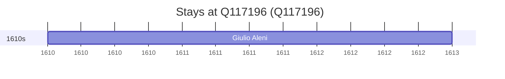

# Q117196

*(fetch error: HTTP Error 429: Too Many Requests)*

Wikidata: [Q117196](https://www.wikidata.org/wiki/Q117196)

1 occurrence(s) across 1 transcribed value(s), 1 person(s).

**Transcribed variants:**

- `Salcete, Índia` (1×, 1610–1610)

| Date | Variant | Person | Type | Entity id | Real entity |
|------|---------|--------|------|-----------|-------------|
| 1610-01 | Salcete, Índia | Giulio Aleni | estadia | [deh-giulio-aleni](deh-giulio-aleni) | — |

