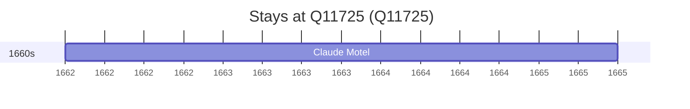

# Q11725

*(fetch error: HTTP Error 429: Too Many Requests)*

Wikidata: [Q11725](https://www.wikidata.org/wiki/Q11725)

1 occurrence(s) across 1 transcribed value(s), 1 person(s).

**Transcribed variants:**

- `Chungking (Tch'ong-k'ing, Sseu-tch0ouan)` (1×, 1662–1662)

| Date | Variant | Person | Type | Entity id | Real entity |
|------|---------|--------|------|-----------|-------------|
| 1662 | Chungking (Tch'ong-k'ing, Sseu-tch0ouan) | Claude Motel | estadia | [deh-claude-motel](deh-claude-motel) | — |

