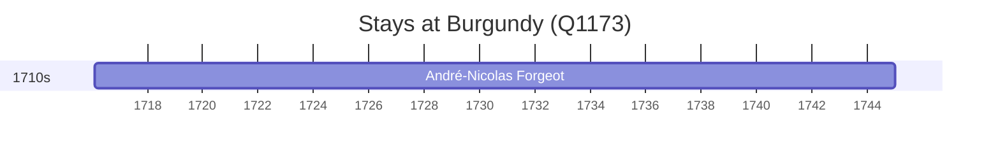

# Burgundy (Q1173)

*former administrative region of France*

Wikidata: [Q1173](https://www.wikidata.org/wiki/Q1173)

1 occurrence(s) across 1 transcribed value(s), 1 person(s).

**Transcribed variants:**

- `Borgonha` (1×, 1716–1716)

| Date | Variant | Person | Type | Entity id | Real entity |
|------|---------|--------|------|-----------|-------------|
| 1716-02-09 | Borgonha | André-Nicolas Forgeot | nascimento | [deh-andre-nicolas-forgeot](deh-andre-nicolas-forgeot) | — |

