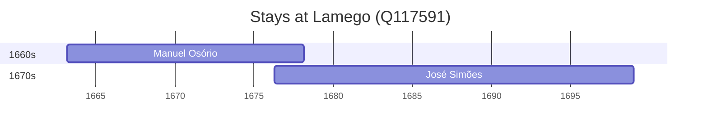

# Lamego (Q117591)

*municipality in Norte, Portugal*

Wikidata: [Q117591](https://www.wikidata.org/wiki/Q117591)

2 occurrence(s) across 1 transcribed value(s), 2 person(s).

**Transcribed variants:**

- `Lamego` (2×, 1663–1676)

| Date | Variant | Person | Type | Entity id | Real entity |
|------|---------|--------|------|-----------|-------------|
| 1663-03-05 | Lamego | Manuel Osório | nascimento | [deh-manuel-osorio-i](deh-manuel-osorio-i) | — |
| 1676-04-12 | Lamego | José Simões | nascimento | [deh-jose-simoes](deh-jose-simoes) | — |

### Co-presence

These persons were plausibly at this place during overlapping periods (interval estimation from stay dates; rough — see method note below).

| Period | Persons |
|--------|---------|
| 1670s | [José Simões](deh-jose-simoes), [Manuel Osório](deh-manuel-osorio-i) |

*1 overlapping pair(s) involving 2 person(s). Method: interval start = stay event date; end = next embarque/partida/different-place event, or death, or +15yr cap.*

