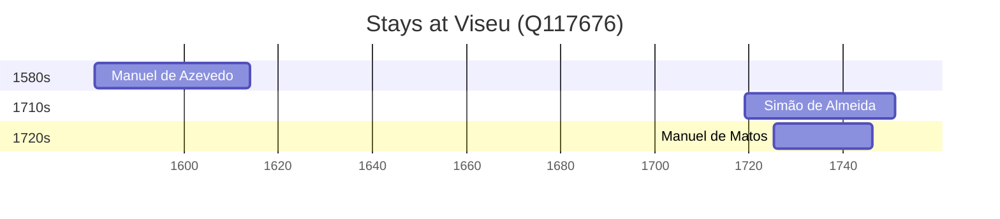

# Viseu (Q117676)

*municipality in Portugal*

Wikidata: [Q117676](https://www.wikidata.org/wiki/Q117676)

3 occurrence(s) across 1 transcribed value(s), 3 person(s).

**Transcribed variants:**

- `Viseu` (3×, 1581–1725)

| Date | Variant | Person | Type | Entity id | Real entity |
|------|---------|--------|------|-----------|-------------|
| 1581 | Viseu | Manuel de Azevedo | nascimento | [deh-manuel-de-azevedo](deh-manuel-de-azevedo) | — |
| 1718-12-25 | Viseu | Simão de Almeida | nascimento | [deh-simao-de-almeida](deh-simao-de-almeida) | — |
| 1725-05-10 | Viseu | Manuel de Matos | nascimento | [deh-manuel-de-matos](deh-manuel-de-matos) | — |

### Co-presence

These persons were plausibly at this place during overlapping periods (interval estimation from stay dates; rough — see method note below).

| Period | Persons |
|--------|---------|
| 1720s | [Manuel de Matos](deh-manuel-de-matos), [Simão de Almeida](deh-simao-de-almeida) |

*1 overlapping pair(s) involving 2 person(s). Method: interval start = stay event date; end = next embarque/partida/different-place event, or death, or +15yr cap.*

