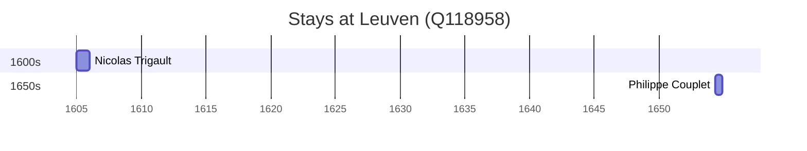

# Leuven (Q118958)

*capital city of Flemish Brabant, Belgium*

Wikidata: [Q118958](https://www.wikidata.org/wiki/Q118958)

3 occurrence(s) across 1 transcribed value(s), 3 person(s).

**Transcribed variants:**

- `Leuven` (3×, 1605–1654)

| Date | Variant | Person | Type | Entity id | Real entity |
|------|---------|--------|------|-----------|-------------|
| — | Leuven | Jean de Haynin | estadia | [deh-jean-de-haynin](deh-jean-de-haynin) | — |
| 1605 | Leuven | Nicolas Trigault | estadia | [deh-nicolas-trigault](deh-nicolas-trigault) | — |
| 1654-05-06 | Leuven | Philippe Couplet | estadia | [deh-philippe-couplet](deh-philippe-couplet) | [rp551005](rp551005) |

