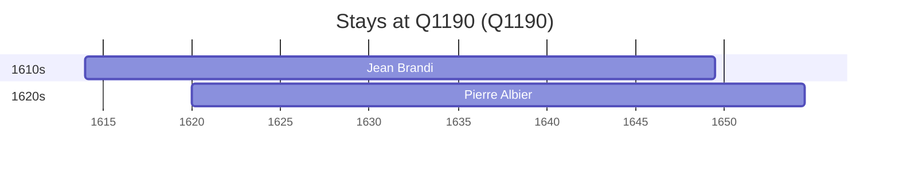

# Q1190

*(fetch error: HTTP Error 429: Too Many Requests)*

Wikidata: [Q1190](https://www.wikidata.org/wiki/Q1190)

2 occurrence(s) across 1 transcribed value(s), 2 person(s).

**Transcribed variants:**

- `Limousin` (2×, 1614–1620)

| Date | Variant | Person | Type | Entity id | Real entity |
|------|---------|--------|------|-----------|-------------|
| 1614 | Limousin | Jean Brandi | nascimento | [deh-jean-brandi](deh-jean-brandi) | — |
| 1620 | Limousin | Pierre Albier | nascimento | [deh-pierre-albier](deh-pierre-albier) | — |

### Co-presence

These persons were plausibly at this place during overlapping periods (interval estimation from stay dates; rough — see method note below).

| Period | Persons |
|--------|---------|
| 1620s | [Jean Brandi](deh-jean-brandi), [Pierre Albier](deh-pierre-albier) |

*1 overlapping pair(s) involving 2 person(s). Method: interval start = stay event date; end = next embarque/partida/different-place event, or death, or +15yr cap.*

