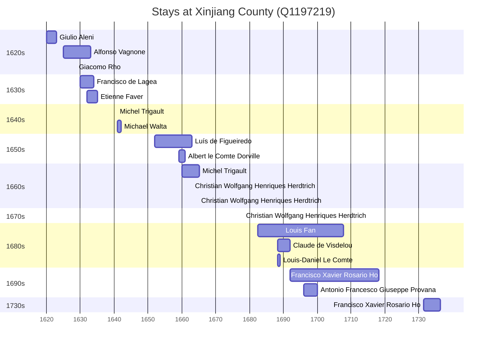

# Xinjiang County (Q1197219)

*county in Yuncheng Prefecture, Shanxi Province, China*

Wikidata: [Q1197219](https://www.wikidata.org/wiki/Q1197219)

30 occurrence(s) across 5 transcribed value(s), 15 person(s).

**Transcribed variants:**

- `Kiangchow` (11×, 1620–1731)
- `Kiangchow, Chan-si` (7×, 1624–1696)
- `Kiangchow, Shansi` (10×, 1628–1695)
- `Kiangcchow, Shansi` (1×, 1632–1632)
- `Kiam cheu, Kiangchow, Shansi` (1×, 1663–1663)

| Date | Variant | Person | Type | Entity id | Real entity |
|------|---------|--------|------|-----------|-------------|
| — | Kiangchow | Christian Wolfgang Henriques Herdtrich | estadia | [deh-christian-wolfgang-henriques-herdtrich](deh-christian-wolfgang-henriques-herdtrich) | [rp669413](rp669413) |
| — | Kiangchow | Louis-Daniel Le Comte | estadia | [deh-louis-daniel-le-comte](deh-louis-daniel-le-comte) | — |
| — | Kiangchow | Michel Trigault | estadia | [deh-michel-trigault](deh-michel-trigault) | — |
| 1620 | Kiangchow | Giulio Aleni | estadia | [deh-giulio-aleni](deh-giulio-aleni) | — |
| 1624-12 | Kiangchow, Chan-si | Alfonso Vagnone | estadia | [deh-alfonso-vagnone](deh-alfonso-vagnone) | — |
| 1628-08-28 | Kiangchow, Shansi | Giacomo Rho | jesuita-votos-local | [deh-giacomo-rho](deh-giacomo-rho) | — |
| 1630 | Kiangchow, Shansi | Francisco de Lagea | estadia | [deh-francisco-de-lagea](deh-francisco-de-lagea) | — |
| 1632 | Kiangcchow, Shansi | Etienne Faver | estadia | [deh-etienne-faber](deh-etienne-faber) | — |
| 1640-04-09 | Kiangchow, Chan-si | Alfonso Vagnone | morte | [deh-alfonso-vagnone](deh-alfonso-vagnone) | — |
| 1640-10-09 | Kiangchow | Michel Trigault | jesuita-votos-local | [deh-michel-trigault](deh-michel-trigault) | — |
| 1641 | Kiangchow, Chan-si | Michael Walta | estadia | [deh-michael-walta](deh-michael-walta) | — |
| 1648 | Kiangchow, Chan-si | Michel Trigault | partida | [deh-michel-trigault](deh-michel-trigault) | — |
| 1652 | Kiangchow, Shansi | Luís de Figueiredo | estadia | [deh-luis-de-figueiredo](deh-luis-de-figueiredo) | — |
| 1654 | Kiangchow, Shansi | Luís de Figueiredo | estadia | [deh-luis-de-figueiredo](deh-luis-de-figueiredo) | — |
| 1659 | Kiangchow, Shansi | Albert le Comte Dorville | estadia | [deh-albert-le-comte-dorville](deh-albert-le-comte-dorville) | — |
| 1660 | Kiangchow | Michel Trigault | estadia | [deh-michel-trigault](deh-michel-trigault) | — |
| 1661 | Kiangchow, Shansi | Albert le Comte Dorville | estadia | [deh-albert-le-comte-dorville](deh-albert-le-comte-dorville) | — |
| 1663 | Kiam cheu, Kiangchow, Shansi | Christian Wolfgang Henriques Herdtrich | estadia | [deh-christian-wolfgang-henriques-herdtrich](deh-christian-wolfgang-henriques-herdtrich) | [rp669413](rp669413) |
| 1664-09-14 | Kiangchow, Shansi | Christian Wolfgang Henriques Herdtrich | estadia | [deh-christian-wolfgang-henriques-herdtrich](deh-christian-wolfgang-henriques-herdtrich) | [rp669413](rp669413) |
| 1678 | Kiangchow | Christian Wolfgang Henriques Herdtrich | estadia | [deh-christian-wolfgang-henriques-herdtrich](deh-christian-wolfgang-henriques-herdtrich) | [rp669413](rp669413) |
| 1682-06-13 | Kiangchow, Shansi | Louis Fan | nascimento | [deh-louis-fan](deh-louis-fan) | — |
| 1684-07-17 | Kiangchow, Chan-si | Christian Wolfgang Henriques Herdtrich | morte | [deh-christian-wolfgang-henriques-herdtrich](deh-christian-wolfgang-henriques-herdtrich) | [rp669413](rp669413) |
| 1688-04-14 | Kiangchow, Chan-si | Claude de Visdelou | estadia | [deh-claude-de-visdelou](deh-claude-de-visdelou) | — |
| 1688-04-14 | Kiangchow | Louis-Daniel Le Comte | estadia | [deh-louis-daniel-le-comte](deh-louis-daniel-le-comte) | — |
| 1692 | Kiangchow, Shansi | Francisco Xavier Rosario Ho | estadia | [deh-francisco-xavier-rosario-ho](deh-francisco-xavier-rosario-ho) | [rp419976](rp419976) |
| 1695 | Kiangchow, Shansi | Francisco Xavier Rosario Ho | estadia | [deh-francisco-xavier-rosario-ho](deh-francisco-xavier-rosario-ho) | [rp419976](rp419976) |
| 1696 | Kiangchow, Chan-si | Antonio Francesco Giuseppe Provana | estadia | [deh-antonio-francesco-giuseppe-provana](deh-antonio-francesco-giuseppe-provana) | [rp445313](rp445313) |
| 1700-11-01 | Kiangchow | Francisco Xavier Rosario Ho | jesuita-votos-local | [deh-francisco-xavier-rosario-ho](deh-francisco-xavier-rosario-ho) | [rp419976](rp419976) |
| 1731-06 | Kiangchow | Francisco Xavier Rosario Ho | estadia | [deh-francisco-xavier-rosario-ho](deh-francisco-xavier-rosario-ho) | [rp419976](rp419976) |
| 1731-08 | Kiangchow | Francisco Xavier Rosario Ho | estadia | [deh-francisco-xavier-rosario-ho](deh-francisco-xavier-rosario-ho) | [rp419976](rp419976) |

### Co-presence

These persons were plausibly at this place during overlapping periods (interval estimation from stay dates; rough — see method note below).

| Period | Persons |
|--------|---------|
| 1620s | [Alfonso Vagnone](deh-alfonso-vagnone), [Giacomo Rho](deh-giacomo-rho) |
| 1630s | [Alfonso Vagnone](deh-alfonso-vagnone), [Etienne Faver](deh-etienne-faber), [Francisco de Lagea](deh-francisco-de-lagea) |
| 1650s | [Albert le Comte Dorville](deh-albert-le-comte-dorville), [Luís de Figueiredo](deh-luis-de-figueiredo) |
| 1660s | [Albert le Comte Dorville](deh-albert-le-comte-dorville), [Christian Wolfgang Henriques Herdtrich](rp669413), [Luís de Figueiredo](deh-luis-de-figueiredo), [Michel Trigault](deh-michel-trigault) |
| 1680s | [Claude de Visdelou](deh-claude-de-visdelou), [Louis Fan](deh-louis-fan), [Louis-Daniel Le Comte](deh-louis-daniel-le-comte) |
| 1690s | [Antonio Francesco Giuseppe Provana](rp445313), [Claude de Visdelou](deh-claude-de-visdelou), [Francisco Xavier Rosario Ho](rp419976), [Louis Fan](deh-louis-fan) |

*16 overlapping pair(s) involving 13 person(s). Method: interval start = stay event date; end = next embarque/partida/different-place event, or death, or +15yr cap.*

