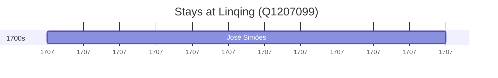

# Linqing (Q1207099)

*county-level city*

Wikidata: [Q1207099](https://www.wikidata.org/wiki/Q1207099)

2 occurrence(s) across 2 transcribed value(s), 2 person(s).

**Transcribed variants:**

- `[No mar, para lá de Lin-tsing (Lin-ts'ing, Shantung)]` (1×, 1704–1704)
- `Lintsing` (1×, 1707–1707)

| Date | Variant | Person | Type | Entity id | Real entity |
|------|---------|--------|------|-----------|-------------|
| 1704-09-18 | [No mar, para lá de Lin-tsing (Lin-ts'ing, Shantung)] | Jean-Charles Etienne Froissard de Broissia | morte | [deh-jean-charles-etienne-froissard-de-broissia](deh-jean-charles-etienne-froissard-de-broissia) | — |
| 1707-06 | Lintsing | José Simões | estadia | [deh-jose-simoes](deh-jose-simoes) | — |

