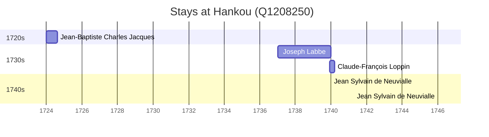

# Hankou (Q1208250)

*former town, now part of Wuhan*

Wikidata: [Q1208250](https://www.wikidata.org/wiki/Q1208250)

5 occurrence(s) across 4 transcribed value(s), 4 person(s).

**Transcribed variants:**

- `Hankow (Han-k'eou)` (1×, 1724–1724)
- `Hankow` (1×, 1737–1737)
- `Hankou (Han-k'eou)` (1×, 1739–1739)
- `Hankow, Hou-pei` (2×, 1740–1746)

| Date | Variant | Person | Type | Entity id | Real entity |
|------|---------|--------|------|-----------|-------------|
| 1724 | Hankow (Han-k'eou) | Jean-Baptiste Charles Jacques | estadia | [deh-jean-baptiste-charles-jacques](deh-jean-baptiste-charles-jacques) | — |
| 1737 | Hankow | Joseph Labbe | estadia | [deh-joseph-labbe](deh-joseph-labbe) | — |
| 1739-12-07 | Hankou (Han-k'eou) | Claude-François Loppin | estadia | [deh-claude-francois-loppin](deh-claude-francois-loppin) | — |
| 1740 | Hankow, Hou-pei | Jean Sylvain de Neuvialle | estadia | [deh-jean-sylvain-de-neuvialle](deh-jean-sylvain-de-neuvialle) | — |
| 1746 | Hankow, Hou-pei | Jean Sylvain de Neuvialle | estadia | [deh-jean-sylvain-de-neuvialle](deh-jean-sylvain-de-neuvialle) | — |

### Co-presence

These persons were plausibly at this place during overlapping periods (interval estimation from stay dates; rough — see method note below).

| Period | Persons |
|--------|---------|
| 1730s | [Claude-François Loppin](deh-claude-francois-loppin), [Joseph Labbe](deh-joseph-labbe) |
| 1740s | [Claude-François Loppin](deh-claude-francois-loppin), [Jean Sylvain de Neuvialle](deh-jean-sylvain-de-neuvialle) |

*2 overlapping pair(s) involving 3 person(s). Method: interval start = stay event date; end = next embarque/partida/different-place event, or death, or +15yr cap.*

