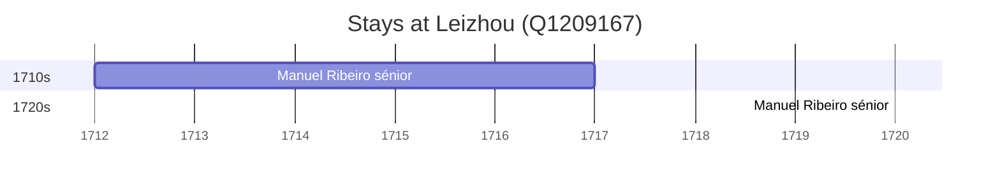

# Leizhou (Q1209167)

*county-level city in Guangdong, China*

Wikidata: [Q1209167](https://www.wikidata.org/wiki/Q1209167)

3 occurrence(s) across 2 transcribed value(s), 2 person(s).

**Transcribed variants:**

- `Lui-tcheou` (2×, 1712–1720)
- `Luichow, Kwangtung` (1×, undated)

| Date | Variant | Person | Type | Entity id | Real entity |
|------|---------|--------|------|-----------|-------------|
| — | Luichow, Kwangtung | Pietro Francesco Capacci | estadia | [deh-pietro-francesco-capacci](deh-pietro-francesco-capacci) | — |
| 1712 | Lui-tcheou | Manuel Ribeiro, sénior | estadia | [deh-manuel-ribeiro-senior](deh-manuel-ribeiro-senior) | — |
| 1720 | Lui-tcheou | Manuel Ribeiro, sénior | estadia | [deh-manuel-ribeiro-senior](deh-manuel-ribeiro-senior) | — |

